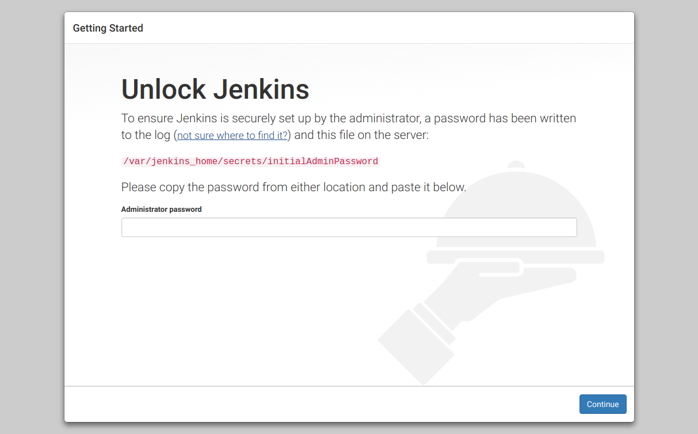

Ahora nos pedirán que identifiquemos el pass de administrador de la instalación del nuevo contenedor de jenkins. Para ello accederemos a la consola en la carpeta del proyecto y utilizaremos el comando `docker exec -ti jenkins bash` para acceder a la terminal de jenkins, siendo `jenkins`el nombre de nuestro contenedor activo de jenkins (`docker ps`).

```bash
demo@VirtualBox:~/Demo_Docker$ docker exec -ti jenkins bash
jenkins@c896504a004b:/$
```

Posteriormente usaremos el comando de linux `cat`para visualizar el contendio del archivo indicado `cat /var/jenkins_home/secrets/initialAdminPassword`.

```bash
jenkins@c896504a004b:/$ cat /var/jenkins_home/secrets/initialAdminPassword
926bb4a50e804def81597a13d5afa8c8
jenkins@c896504a004b:/$
```

Ya disponemos de nuestro Pasword inicial de administrador, el cual al introducirlo y pulsar en **Continue** nos llevará a la siguiente pantalla.

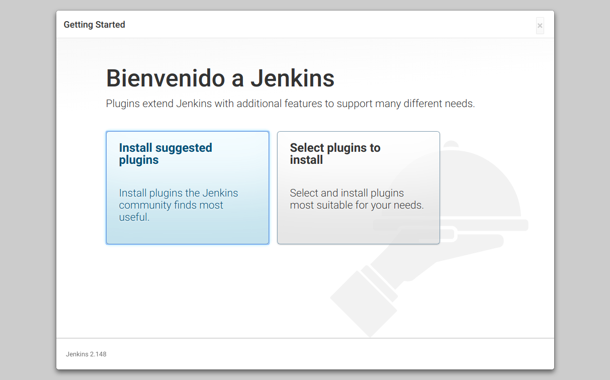

Aquí inicialmente indicaremos que queremos instalar los plugins por defecto.

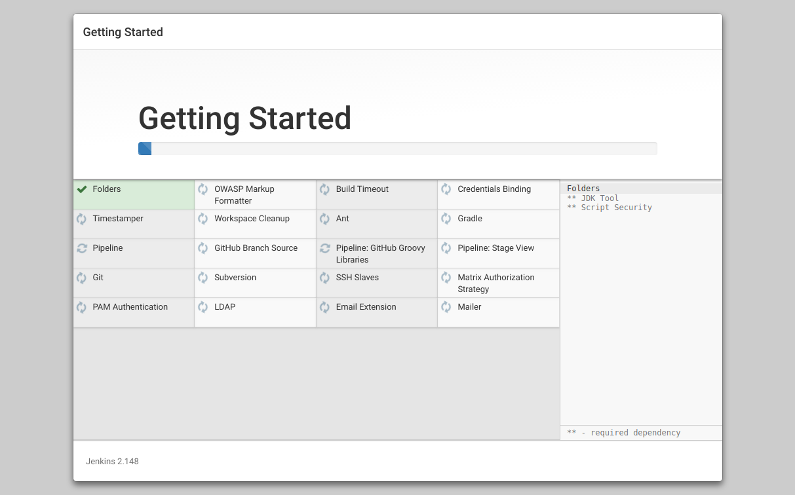

Esperamos a que se instalen, y en la siguiente pantalla incluimos los datos de acceso de nuestra aplicación jenkins.


En indicamos la url de acceso a nuestra instalación, en este caso por defecto será [http:://localhost:8080/](http:://localhost:8080/)

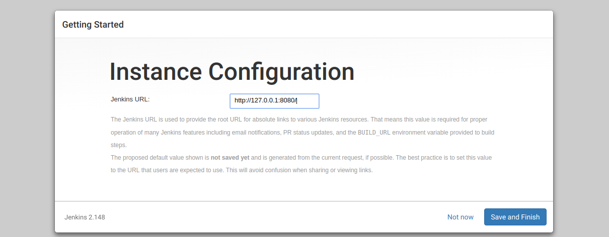

Y accedemos a Jenkins ...

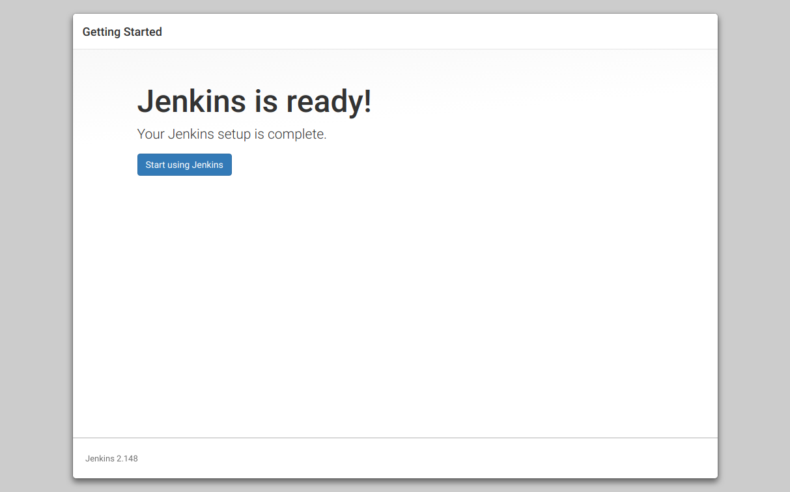

---------------------------------------------------------

### Primeros Pasos

---------------------------------------------------------

Aquí tenemos el dashboard de **Jenkins** con sus distintas opciones.

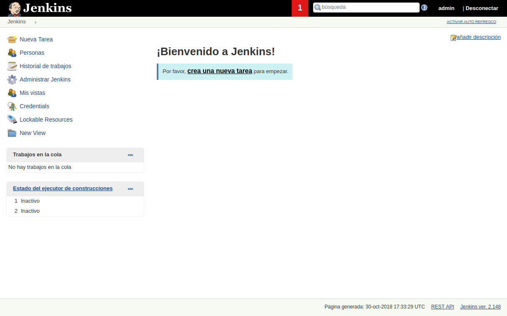

El dashboard de jenkins consta de :
    * **Jobs/tareas/proyectos**
    * **Personas**, son usuarios del sistema. En Jenkins podemos habilitar o deshabilitar la autentificación
    * **Historial de trabajos**. Cada Job tiene un histórico, y cada vez que ejecutamos una tarea genera un historial.
    * **Administrar Jenkins**, es la parte de configuraciones del sistema.
    * **Mis vistas**, permite generar vistas o dashboards propios.
    * **Credenciales**
    * **New Views**

Un job es una tarea o cúmulo de tareas o pasos. 

> Jenkins permite realizar las tareas desde un servidor o desde la propia máquina local. En nuestro caso usaremos jenkins en local, aunque posteriormente veremos como hacerlo conectado con un servidor.

Para acceder a crear una nueva tarea accederemos a [Nueva Tarea](http://127.0.0.1:8080/view/all/newJob), dónde veremos una pantalla como la siguiente que nos permitirá crear distintos tipos de tareas.


Creamos un primer proyecto de estilo libre, el cual tendrá:

* Una descripción `Este es un job de test`.
* Y una ejecución **línea de comandos shell**.

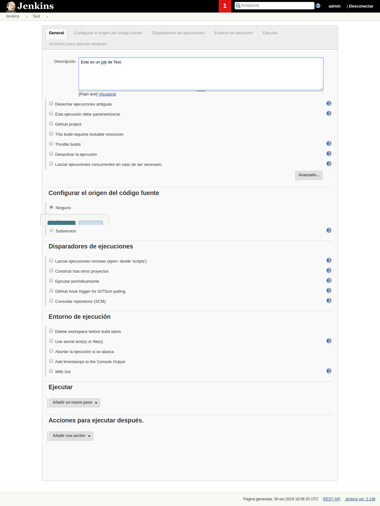
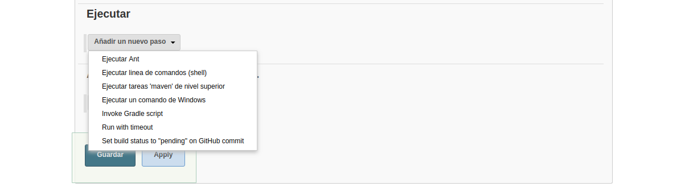
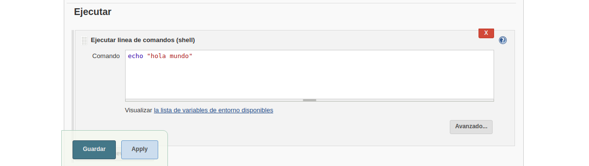

Una vez guardada la tarea accederemos a **construir ahora** la tarea y nos aparecerá en el cuadro inferior un historial de ejecuciones de la tarea junto a la opción de ver en terminal, la cual pulsaremos para comprobar la resultante en terminal.

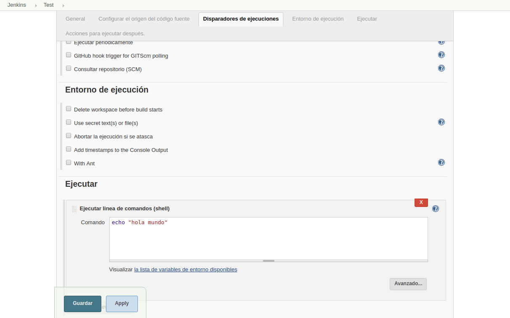

Esta será la vista de la resultante en terminal.

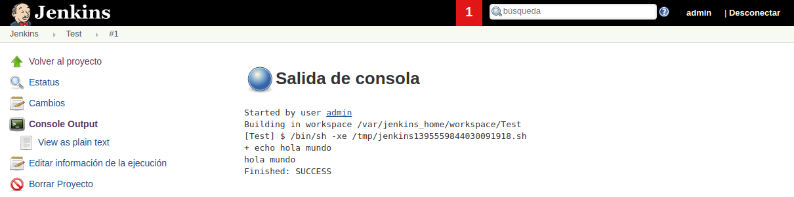

> Jenkins construye un script bash con el código escrito en esa shell de jenkins y lo ejecuta.

**Acabamos de crear nuestro primer jobs el cual dispone de un comando y realiza una primera ejecución.**

Ahora modificaremos el jobs accediendo a la pestaña de **configruación** del jobs para cambiar la configuracion.

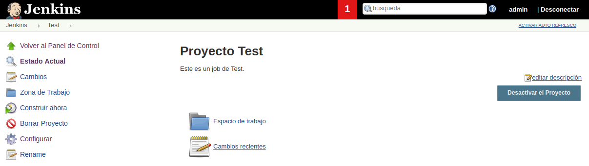

#### Funciones de linux Shell

Comando Shell a incluir `echo "La fecha y hora es: $(date)"`, una vez guardado ejecutaremos construir jobs y accederemos nuevamente a la terminal para visualizar el output.

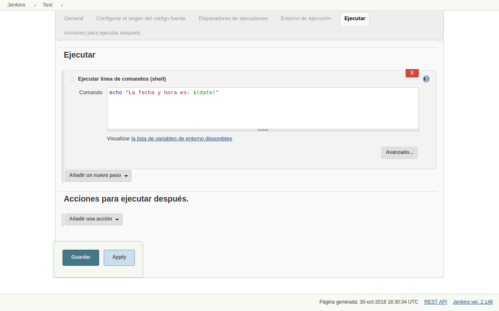

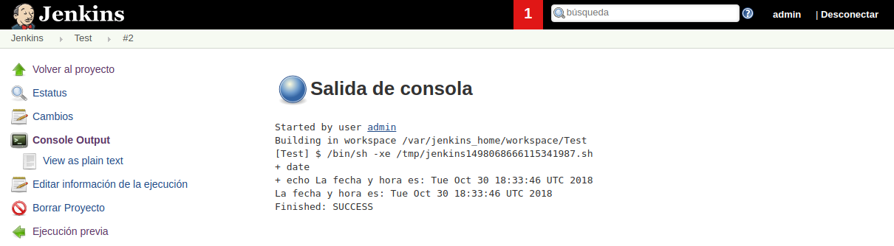

#### Variables de entorno

Comandos Shell a incluir:

```bash
NOMBRE="ricardo"
echo "hola, $NOMBRE" > /tmp/nombre
```

Una vez guardado ejecutaremos construir jobs y accederemos nuevamente a la terminal para visualizar el output.

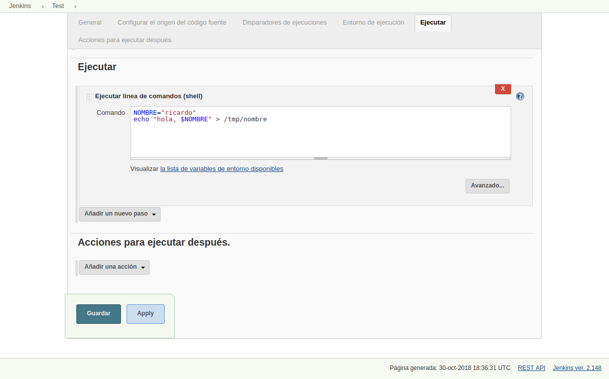

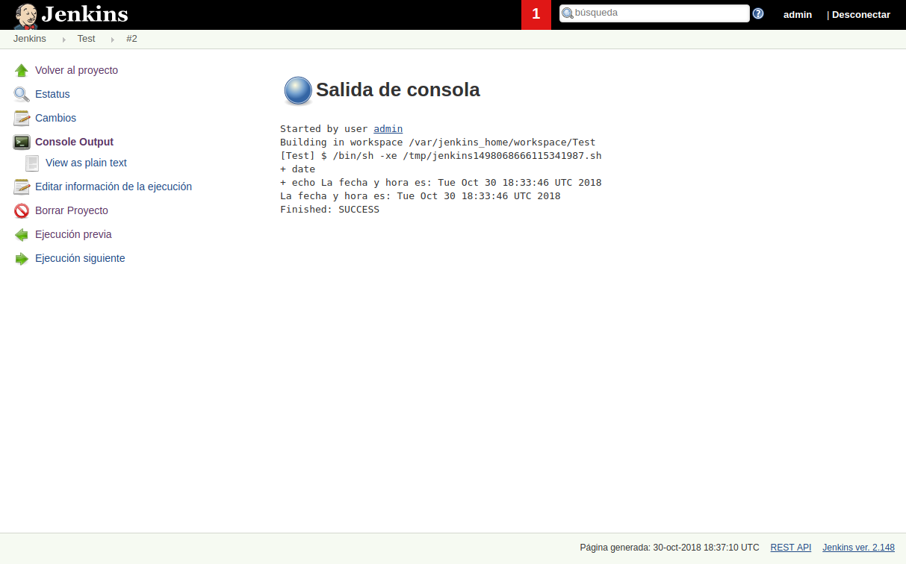

En este último ejemplo hemos creado un nuevo archivo con un contenido definido, por lo que si accedemos a la terminal del contenedor `docker exec -ti jenkins bash`.

```bash
demo@VirtualBox:~/Demo_Docker$ docker exec -ti jenkins bash
jenkins@c896504a004b:/$
```

Y accedemos a la ubicación del archivo indicado `/tmp/nombre`, podremos ver el contenido del mismo.

```bash
jenkins@c896504a004b:/$ ls
bin   dev               etc   lib    media  opt   root  sbin  sys  usr
boot  docker-java-home  home  lib64  mnt    proc  run   srv   tmp  var

jenkins@c896504a004b:/$ cd tmp

jenkins@c896504a004b:/tmp$ ls
hsperfdata_jenkins                                   jna--1712433994
hsperfdata_root                                      nombre
jetty-0.0.0.0-8080-war-_-any-743831612360637085.dir  winstone2747702198265079682.jar

jenkins@c896504a004b:/tmp$ cat nombre
hola, ricardo
```

**Ejercicio:** Crear una nueva modificación en shel con el código:

```bash
NOMBRE="ricardo"
echo "hola, $NOMBRE. La hora es $(date +%F)" > /tmp/nombre
```


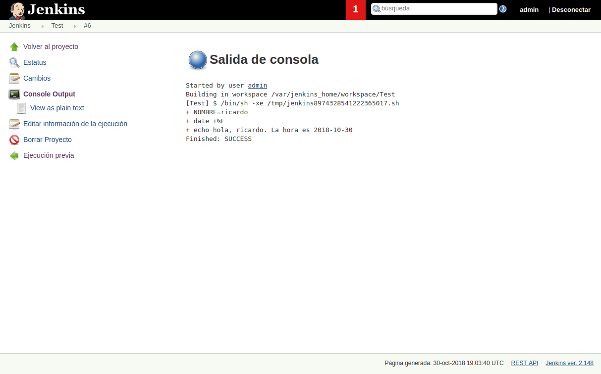


---------------------------------------------------------

### Ejecutar script externo desde el job

---------------------------------------------------------

Primeramente generaremos un script bash.

```bash
#!/bint/bash
echo "hola, $NOMBRE $APELLIDO"
```

Si ejecutassemos este script en consola no se imprimiría nada más que la parte sin variables, ya que las mismas están aún sin definir.