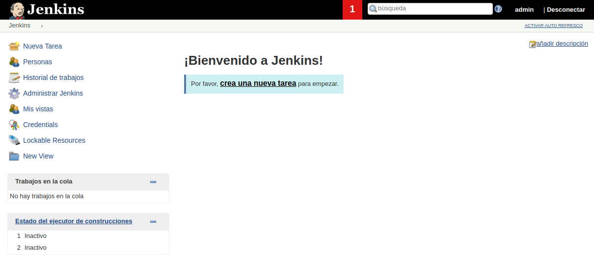
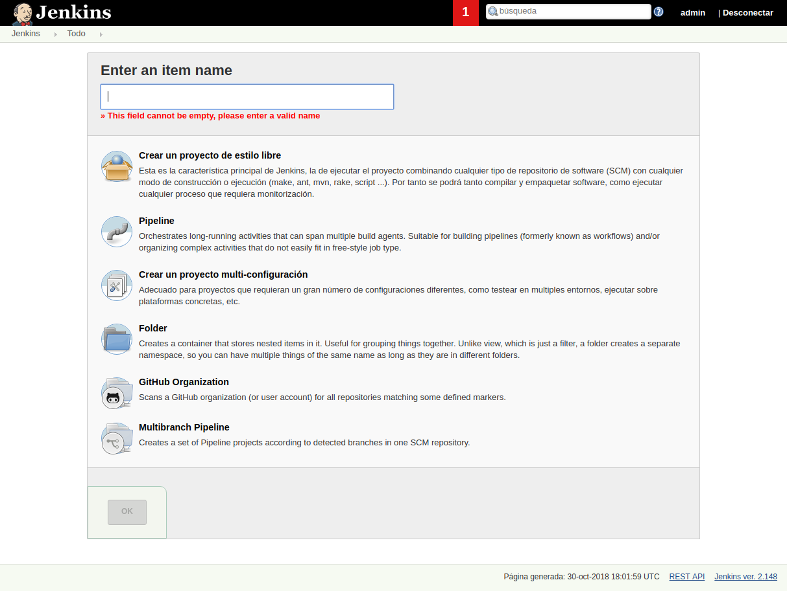

Ahora nos pedirán que identifiquemos el pass de administrador de la instalación del nuevo contenedor de jenkins. Para ello accederemos a la consola en la carpeta del proyecto y utilizaremos el comando `docker exec -ti jenkins bash` para acceder a la terminal de jenkins, siendo `jenkins`el nombre de nuestro contenedor activo de jenkins (`docker ps`).

```bash
demo@VirtualBox:~/Demo_Docker$ docker exec -ti jenkins bash
jenkins@c896504a004b:/$
```

Posteriormente usaremos el comando de linux `cat`para visualizar el contendio del archivo indicado `cat /var/jenkins_home/secrets/initialAdminPassword`.

```bash
jenkins@c896504a004b:/$ cat /var/jenkins_home/secrets/initialAdminPassword
926bb4a50e804def81597a13d5afa8c8
jenkins@c896504a004b:/$
```

Ya disponemos de nuestro Pasword inicial de administrador, el cual al introducirlo y pulsar en **Continue** nos llevará a la siguiente pantalla.


Aquí inicialmente indicaremos que queremos instalar los plugins por defecto.


Esperamos a que se instalen, y en la siguiente pantalla incluimos los datos de acceso de nuestra aplicación jenkins.


En indicamos la url de acceso a nuestra instalación, en este caso por defecto será [http:://localhost:8080/](http:://localhost:8080/)


Y accedemos a Jenkins ...

]

---------------------------------------------------------

### Primeros Pasos

---------------------------------------------------------

Aquí tenemos el dashboard de **Jenkins** con sus distintas opciones.

]

El dashboard de jenkins consta de :
    * **Jobs/tareas/proyectos**
    * **Personas**, son usuarios del sistema. En Jenkins podemos habilitar o deshabilitar la autentificación
    * **Historial de trabajos**. Cada Job tiene un histórico, y cada vez que ejecutamos una tarea genera un historial.
    * **Administrar Jenkins**, es la parte de configuraciones del sistema.
    * **Mis vistas**, permite generar vistas o dashboards propios.
    * **Credenciales**
    * **New Views**

Un job es una tarea o cúmulo de tareas o pasos. 

> Jenkins permite realizar las tareas desde un servidor o desde la propia máquina local. En nuestro caso usaremos jenkins en local, aunque posteriormente veremos como hacerlo conectado con un servidor.

Para acceder a crear una nueva tarea accederemos a [Nueva Tarea](http://127.0.0.1:8080/view/all/newJob), dónde veremos una pantalla como la siguiente que nos permitirá crear distintos tipos de tareas.

]

Creamos un primer proyecto de estilo libre, el cual tendrá:


* Una descripción `Este es un job de test`.
* Y una ejecución **línea de comandos shell**.