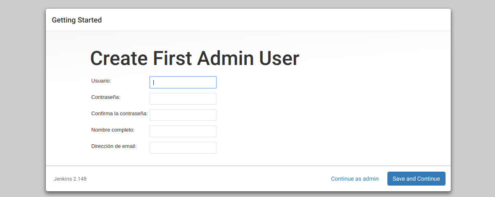
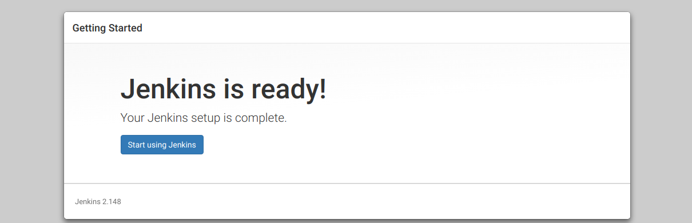
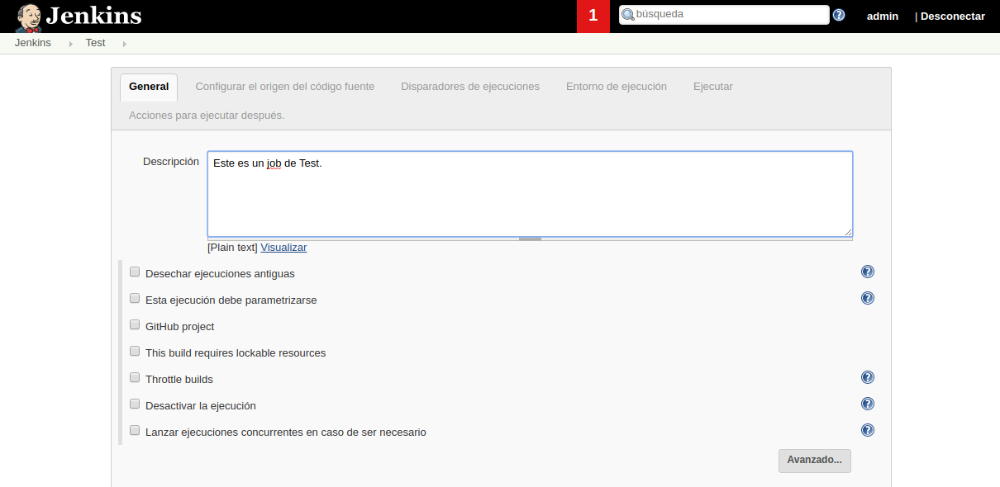
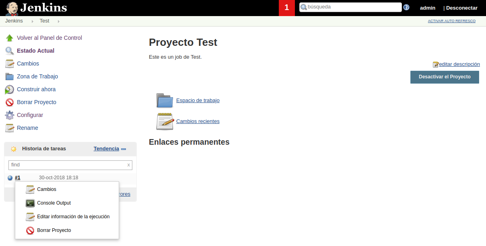
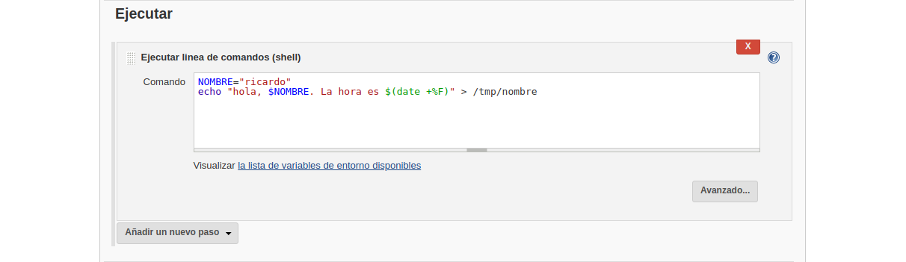
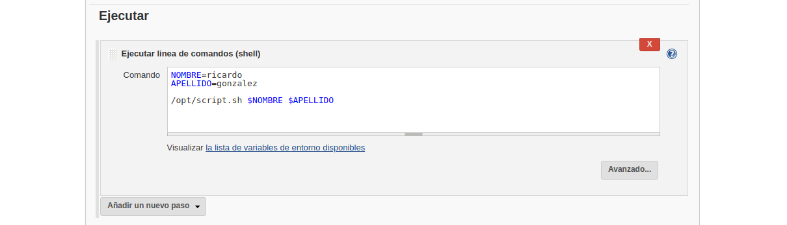

```bash
demo@VirtualBox:~/Demo_Docker$ mkdir jenkins_home
``` 

```bash
demo@VirtualBox:~/Demo_Docker$ sudo su
[sudo] password for demo:
root@hector-VirtualBox:/home/demo/jenkins-by-sample# chown 1000 -R jenkins_home
```

```bash
demo@VirtualBox:~/Demo_Docker$ docker-compose up -d
Starting jenkins ... done

demo@VirtualBox:~/Demo_Docker$ docker ps
CONTAINER ID IMAGE    COMMAND      CREATED   STATUS  PORTS     NAMES
7f41ec7f07ac jenkin.. "/sbin/t..." 55 se...  Up 3..  0.0....   jenkins
```


Ahora nos pedirán que identifiquemos el pass de administrador de la instalación del nuevo contenedor de jenkins. Para ello accederemos a la consola en la carpeta del proyecto y utilizaremos el comando `docker exec -ti jenkins bash` para acceder a la terminal de jenkins, siendo `jenkins`el nombre de nuestro contenedor activo de jenkins (`docker ps`).

```bash
demo@VirtualBox:~/Demo_Docker$ docker exec -ti jenkins bash
jenkins@c896504a004b:/$
```

Posteriormente usaremos el comando de linux `cat`para visualizar el contendio del archivo indicado `cat /var/jenkins_home/secrets/initialAdminPassword`.

```bash
jenkins@c896504a004b:/$ cat /var/jenkins_home/secrets/initialAdminPassword
926bb4a50e804def81597a13d5afa8c8
jenkins@c896504a004b:/$
```

Ya disponemos de nuestro Pasword inicial de administrador, el cual al introducirlo y pulsar en **Continue** nos llevará a la siguiente pantalla.


Aquí inicialmente indicaremos que queremos instalar los plugins por defecto.


Esperamos a que se instalen, y en la siguiente pantalla incluimos los datos de acceso de nuestra aplicación jenkins.



En indicamos la url de acceso a nuestra instalación, en este caso por defecto será [http:://localhost:8080/](http:://localhost:8080/)


Y accedemos a Jenkins ...



---------------------------------------------------------

### Primeros Pasos

---------------------------------------------------------

Aquí tenemos el dashboard de **Jenkins** con sus distintas opciones.


El dashboard de jenkins consta de :
    * **Jobs/tareas/proyectos**
    * **Personas**, son usuarios del sistema. En Jenkins podemos habilitar o deshabilitar la autentificación
    * **Historial de trabajos**. Cada Job tiene un histórico, y cada vez que ejecutamos una tarea genera un historial.
    * **Administrar Jenkins**, es la parte de configuraciones del sistema.
    * **Mis vistas**, permite generar vistas o dashboards propios.
    * **Credenciales**
    * **New Views**

Un job es una tarea o cúmulo de tareas o pasos. 

> Jenkins permite realizar las tareas desde un servidor o desde la propia máquina local. En nuestro caso usaremos jenkins en local, aunque posteriormente veremos como hacerlo conectado con un servidor.

Para acceder a crear una nueva tarea accederemos a [Nueva Tarea](http://127.0.0.1:8080/view/all/newJob), dónde veremos una pantalla como la siguiente que nos permitirá crear distintos tipos de tareas.


Creamos un primer proyecto de estilo libre, el cual tendrá:

* Una descripción `Este es un job de test`.
* Y una ejecución **línea de comandos shell**.




Una vez guardada la tarea accederemos a **construir ahora** la tarea y nos aparecerá en el cuadro inferior un historial de ejecuciones de la tarea junto a la opción de ver en terminal, la cual pulsaremos para comprobar la resultante en terminal.



Esta será la vista de la resultante en terminal.


> Jenkins construye un script bash con el código escrito en esa shell de jenkins y lo ejecuta.

**Acabamos de crear nuestro primer jobs el cual dispone de un comando y realiza una primera ejecución.**

Ahora modificaremos el jobs accediendo a la pestaña de **configruación** del jobs para cambiar la configuracion.


#### Funciones de linux Shell

Comando Shell a incluir `echo "La fecha y hora es: $(date)"`, una vez guardado ejecutaremos construir jobs y accederemos nuevamente a la terminal para visualizar el output.


#### Variables de entorno

Comandos Shell a incluir:

```bash
NOMBRE="ricardo"
echo "hola, $NOMBRE" > /tmp/nombre
```

Una vez guardado ejecutaremos construir jobs y accederemos nuevamente a la terminal para visualizar el output.


En este último ejemplo hemos creado un nuevo archivo con un contenido definido, por lo que si accedemos a la terminal del contenedor `docker exec -ti jenkins bash`.

```bash
demo@VirtualBox:~/Demo_Docker$ docker exec -ti jenkins bash
jenkins@c896504a004b:/$
```

Y accedemos a la ubicación del archivo indicado `/tmp/nombre`, podremos ver el contenido del mismo.

```bash
jenkins@c896504a004b:/$ ls
bin   dev               etc   lib    media  opt   root  sbin  sys  usr
boot  docker-java-home  home  lib64  mnt    proc  run   srv   tmp  var

jenkins@c896504a004b:/$ cd tmp

jenkins@c896504a004b:/tmp$ ls
hsperfdata_jenkins                                   jna--1712433994
hsperfdata_root                                      nombre
jetty-0.0.0.0-8080-war-_-any-743831612360637085.dir  winstone2747702198265079682.jar

jenkins@c896504a004b:/tmp$ cat nombre
hola, ricardo
```

**Ejercicio:** Crear una nueva modificación en shell con el código:

```bash
NOMBRE="ricardo"
echo "hola, $NOMBRE. La hora es $(date +%F)" > /tmp/nombre
```




---------------------------------------------------------

### Ejecutar script externo desde el job

---------------------------------------------------------

Primeramente generaremos un script bash, en nuestro directorio raiz [script.sh](./script.sh).

_[script.sh](./script.sh)_
```bash
#!/bint/bash
echo "hola, $NOMBRE $APELLIDO"
```

Si ejecutasemos este script en consola `sh script.sh` no se imprimiría nada más que la parte sin variables, ya que las mismas están aún sin definir.

```bash
demo@VirtualBox:~/Demo_Docker$ sh script.sh
hola,
```

Habría que definir las variables internas, para ello usaremos **jenkins** para pasarle esas variables.

Para eso primero le daremos permisos de ejecución al script `chmod +x script.sh`, y lo moveremos al contenedor. Para ello moveremos el archivo a dentro del contenedor uasndo el comando `docker cp script.sh jenkins:/opt`.

```bash
demo@VirtualBox:~/Demo_Docker$ chmod +x script.sh
demo@VirtualBox:~/Demo_Docker$ docker cp script.sh jenkins:/opt
```

Y accedemos dentro del contenedor, `docker exec -ti jenkins bash`, para comprobar que existe el archivo copiado `cat /opt/script.sh`.

```bash
demo@VirtualBox:~/Demo_Docker$ docker exec -ti jenkins bash
jenkins@7f41ec7f07ac:/$ cat /opt/script.sh
#!/bint/bash
echo "hola, $NOMBRE $APELLIDO"
```

> Nota: Otra opción sería ejecutar el comando desde fuera `docker exec -ti jenkins bash -c "cat /opt/script.sh"`.

```bash
demo@VirtualBox:~/Demo_Docker$ docker exec -ti jenkins bash -c "cat /opt/script.sh"
#!/bint/bash
echo "hola, $NOMBRE $APELLIDO"
```

Probemos a ejecutar el comando ahora que ya está copiado desde nuestra carpeta.

```bash
demo@VirtualBox:~/Demo_Docker$ docker exec -ti jenkins bash -c "sh /opt/script.sh"
hola,
```

**¿Cómo incluiríamos nuestras variables para la ejecución del script?**

Para ello incluiríamos en la shell de nuestro jobs de **jenkins** primeramente la línea de ejecución del script `/opt/script.sh` más la exportación de las variables requeridas `/opt/script.sh $NOMBRE $APELLIDO`.

**Shell jenkins**
```shell
NOMBRE=ricardo
APELLIDO=gonzalez

/opt/script.sh $NOMBRE $APELLIDO
``` 



Y modificaremos el [script.sh](./script.sh), dentro de nuestra carpeta, para posteriormente volverlo a subir al contendor `docker cp script.sh jenkins:/opt` y que así reconozca dichos parámetros.

> Nota: antes de subir el archivo asegurarse que el mismo tiene permisos de ejecución `chmod +x script.sh`.

_[script.sh](./script.sh)_
```bash
#!/bin/bash
NOMBRE=$1
APELLIDO=$2
echo "hola, $NOMBRE $APELLIDO"
```

```bash
demo@VirtualBox:~/Demo_Docker$ docker cp script.sh jenkins:/opt
```

Comprobamos que se subió correctamente y los cambios persisitieron `docker exec -ti jenkins bash -c "cat /opt/script.sh"`.


```bash
demo@VirtualBox:~/Demo_Docker$ docker exec -ti jenkins bash -c "cat /opt/script.sh"
#!/bin/bash
NOMBRE=$1
APELLIDO=$2
echo "hola, $NOMBRE $APELLIDO"
```

Ahora guardamos el jobs, y volvemos a construirlo para acceder a la salida de terminal y visualizar el resultado.

