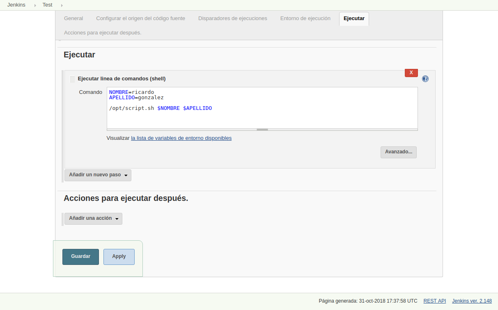
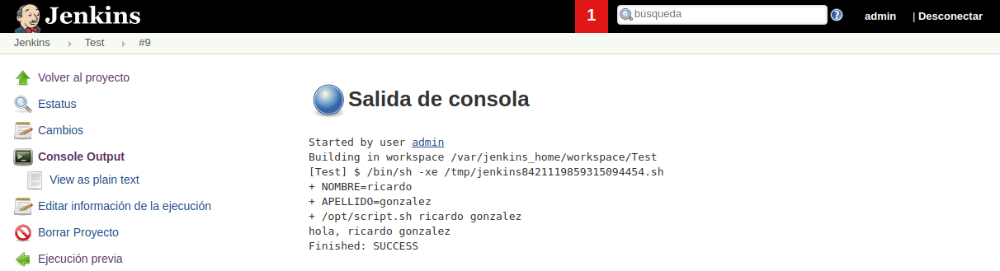

# Ejecutar script externo desde el job

---------------------------------------------------------

En esta demo, veremos como ejecutar un script externo desde la **shell** de **Jenkins**. 

Primeramente generaremos un script bash, en nuestro directorio raiz [script.sh](./script.sh).

_[script.sh](./script.sh)_
```bash
#!/bint/bash
echo "hola, $NOMBRE $APELLIDO"
```

Si ejecutasemos este script en consola `sh script.sh` no se imprimiría nada más que la parte sin variables, ya que las mismas están aún sin definir.

```bash
demo@VirtualBox:~/Demo_Docker$ sh script.sh
hola,
```

Habría que definir las variables internas, para ello usaremos **jenkins** para pasarle esas variables.

Para eso primero le daremos permisos de ejecución al script `chmod +x script.sh`, y lo moveremos al contenedor. Para ello moveremos el archivo a dentro del contenedor uasndo el comando `docker cp script.sh jenkins:/opt`.

```bash
demo@VirtualBox:~/Demo_Docker$ chmod +x script.sh
demo@VirtualBox:~/Demo_Docker$ docker cp script.sh jenkins:/opt
```

Y accedemos dentro del contenedor, `docker exec -ti jenkins bash`, para comprobar que existe el archivo copiado `cat /opt/script.sh`.

```bash
demo@VirtualBox:~/Demo_Docker$ docker exec -ti jenkins bash
jenkins@7f41ec7f07ac:/$ cat /opt/script.sh
#!/bint/bash
echo "hola, $NOMBRE $APELLIDO"
```

> Nota: Otra opción sería ejecutar el comando desde fuera `docker exec -ti jenkins bash -c "cat /opt/script.sh"`.

```bash
demo@VirtualBox:~/Demo_Docker$ docker exec -ti jenkins bash -c "cat /opt/script.sh"
#!/bint/bash
echo "hola, $NOMBRE $APELLIDO"
```

Probemos a ejecutar el comando ahora que ya está copiado desde nuestra carpeta.

```bash
demo@VirtualBox:~/Demo_Docker$ docker exec -ti jenkins bash -c "sh /opt/script.sh"
hola,
```

[Volver al Inicio](#ejecutar-script-externo-desde-el-job)


## ¿CÓMO INCLUIRÍAMOS NUESTRAS VARIABLES PARA LA EJECUCIÓN DEL SCRIPT?

---------------------------------------------------------

Para ello incluiríamos en la shell de nuestro jobs de **jenkins** primeramente la línea de ejecución del script `/opt/script.sh` más la exportación de las variables requeridas `/opt/script.sh $NOMBRE $APELLIDO`.

__**Shell jenkins**__
```shell
NOMBRE=ricardo
APELLIDO=gonzalez

/opt/script.sh $NOMBRE $APELLIDO
``` 



Y modificaremos el [script.sh](./script.sh), dentro de nuestra carpeta, para posteriormente volverlo a subir al contendor `docker cp script.sh jenkins:/opt` y que así reconozca dichos parámetros.

> Nota: antes de subir el archivo asegurarse que el mismo tiene permisos de ejecución `chmod +x script.sh`.

_[script.sh](./script.sh)_
```bash
#!/bin/bash
NOMBRE=$1
APELLIDO=$2
echo "hola, $NOMBRE $APELLIDO"
```

```bash
demo@VirtualBox:~/Demo_Docker$ docker cp script.sh jenkins:/opt
```

Comprobamos que se subió correctamente y los cambios persisitieron `docker exec -ti jenkins bash -c "cat /opt/script.sh"`.


```bash
demo@VirtualBox:~/Demo_Docker$ docker exec -ti jenkins bash -c "cat /opt/script.sh"
#!/bin/bash
NOMBRE=$1
APELLIDO=$2
echo "hola, $NOMBRE $APELLIDO"
```

Ahora guardamos el jobs, y volvemos a construirlo para acceder a la salida de terminal y visualizar el resultado.



[Volver al Inicio](#ejecutar-script-externo-desde-el-job)