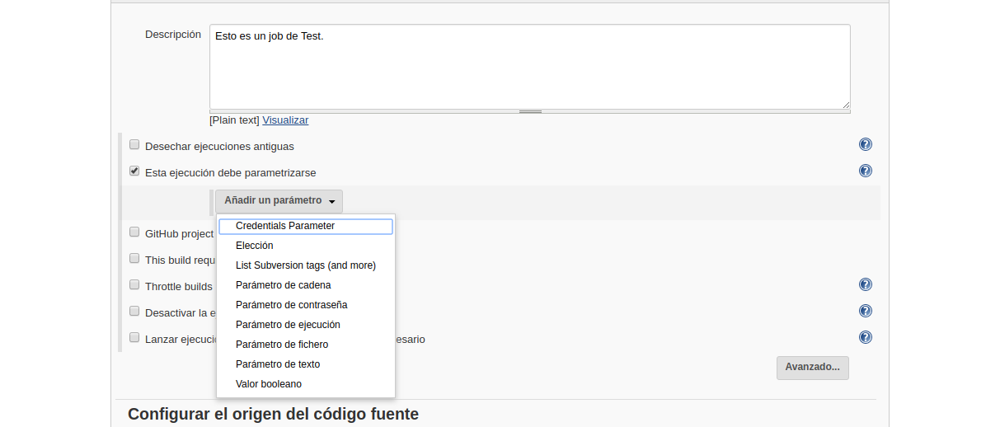
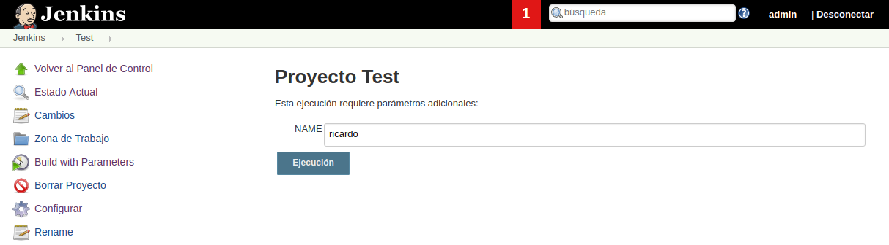
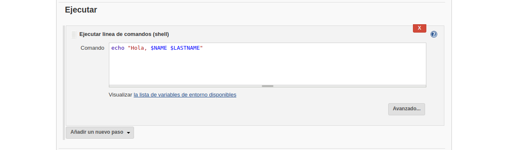
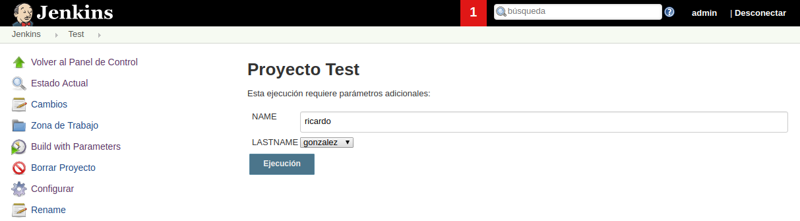

---------------------------------------------------------

### Agregar Parámetros

---------------------------------------------------------

Aunque existe la posibilidad de incluir variables dentro del shell, **jenkins** permite incluir parámetros para su ejecución.

Para ello dentro de la configuración del Job marcaremos la opción de **Esta ejecución debe parametrizarse**.

Existen varias opciones entre las que usaremos primeramente **parámetro de cadena**.

Con el nombre de variable **NAME** y el valor definido **ricardo**.

Accedemos en nuestra **shell de jenkins** e incluimos el siguiente código `echo "Hola $NAME"`.

Guardamos la configuración, y construimos nuevamente el **Job** (**NOTA**: aparecerá **construir con parámetros**). Una vez pulsemos en **Construir con parámetros** nos pedirá que confirmemos el valor de las variables.

Si volvemos a acceder a la salida de la terminal veremos el resultado obtenido.

> **NOTA IMPORTANTE:** Esta opción nos permite cambiar el valor de las variables.

Ahora podemos repetir la construcción del jobs cambiando los valores de los parámetros incluidos.

---------------------------------------------------------

### Tipos de Parámetros

---------------------------------------------------------

#### Elección

Y añadimos en nuestro shell el siguiente código `echo "hola, $NAME $APELLIDO"`.

Guardamos el job, para seguidamente regenerar el job, elegir los valores de los parámetros y ver la salida en terminal.

#### Booleano

En este ejemplo incluiremos el valor de un **booleano** y realizaremos otra prueba.