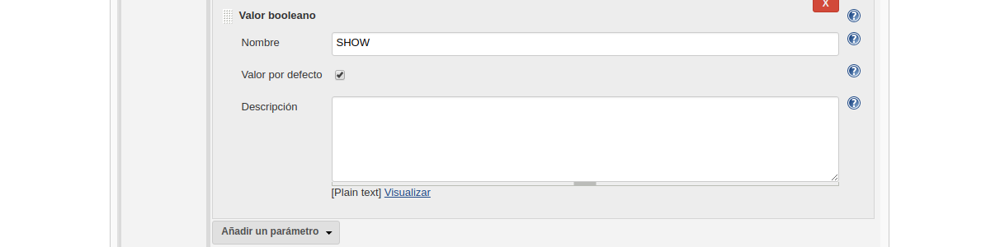
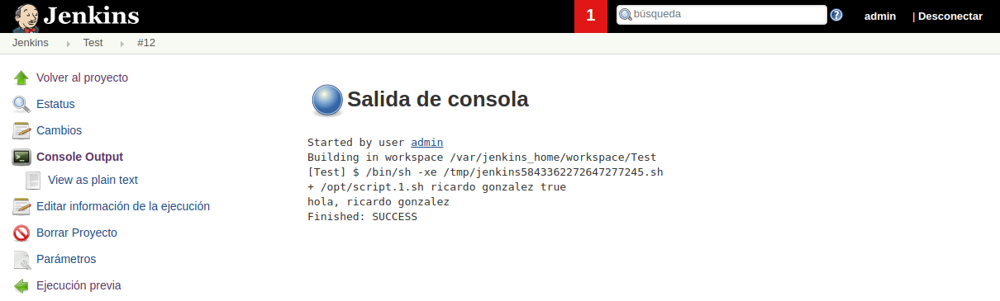

---------------------------------------------------------

### Agregar Parámetros Script

---------------------------------------------------------

Primeramente incluiremos un tercer parámetro **booleano** (`$SHOW`), junto a los valores **string** (`$NAME`) y **selección** (`$LASTNAME`)



Y posteriormente en la shell de nuestro jobs de **jenkins** la línea de ejecución del script `/opt/script.1.sh` más la exportación de las variables requeridas `/opt/script.1.sh $NAME $LASTNAME $SHOW`.

**Shell jenkins**
```shell
/opt/script.1.sh $NAME $LASTNAME $SHOW
``` 


Para este ejemplo incluiremos el siguiente [script.1.sh](./script.1.sh) dentro de nuestra carpeta, para posteriormente volverlo a subir al contendor `docker cp script.1.sh jenkins:/opt` y que así reconozca dichos parámetros.

> Nota: antes de subir el archivo asegurarse que el mismo tiene permisos de ejecución `chmod +x script.1.sh`.

_[script.1.sh](./script.1.sh)_
```sh
#!/bin/bash
NOMBRE=$1
APELLIDO=$2
MOSTRAR=$3

if [ "$MOSTRAR" =  "true" ]; then
    echo "hola, $NOMBRE $APELLIDO"
else
    echo "Si quieres ver el nombre, selecciona la casilla de MOSTRAR"
fi
```

```bash
demo@VirtualBox:~/Demo_Docker$ docker cp script.1.sh jenkins:/opt
```

Comprobamos que se subió correctamente y los cambios persisitieron `docker exec -ti jenkins bash -c "cat /opt/script.1.sh"`.

```bash
demo@VirtualBox:~/Demo_Docker$ docker exec -ti jenkins bash -c "cat /opt/script.1.sh"
#!/bin/bash
NOMBRE=$1
APELLIDO=$2
MOSTRAR=$3

if [ "$MOSTRAR" =  "true" ]; then
    echo "hola, $NOMBRE $APELLIDO"
else
    echo "Si quieres ver el nombre, selecciona la casilla de MOSTRAR"
fi
```

Podemos ejecutar tambié el comando `docker exec -ti jenkins bash -c "/opt/script.1.sh"` para ver que tomaría la variable `$SHOW` como `false`.

```bash
demo@VirtualBox:~/Demo_Docker$ docker exec -ti jenkins bash -c "/opt/script.sh"
Si quieres ver el nombre, selecciona la casilla de MOSTRAR
```

Guardaremos el **job** lo **construiremos con parámetros**, junto a la **definición de sus valores**.


Y probaremos los resultados obtenidos en terminal.



> **NOTA**: Probar opción `$SHOW = false` y `$SHOW = true`.

> **NOTA**: Podemos probar directamente a escribir en la **Shell de jenkins** las variables `echo $NAME $LASTNAME $SHOW`.
