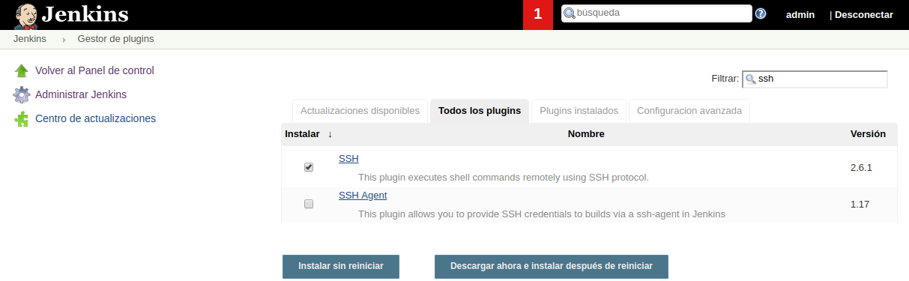

---------------------------------------------------------

### Usar Jenkins en Una Máquina Remota Vía SSH | Parte 2

---------------------------------------------------------

Ahora tendremos que configurar **jenkins** para que utilice dicha llave de autentificación.

Para ello con el contenedor ejecutándose, accederemos a [http://localhost:8080/](http://localhost:8080/).

> **NOTA**: Al haber iniciado una nueva instalación deberemos obtener el password de administrador con el comando de consola `docker exec -ti jenkins bash -c "cat /var/jenkins_home/secrets/initialAdminPassword"`.

```bash
demo@VirtualBox:~/Demo_Docker$ docker exec -ti jenkins bash -c "cat /var/jenkins_home/secrets/initialAdminPassword"
c3aab8f70884458aa8d12f89d6ddfacb
```

Una vez dentro de **jenkins** accederemos a **Administrar jenkins** > **Administrar plugins** y seleccionaremos la opción de 


Seleccionamos el tab de **Todos los plugins** y filtrando por **SSH** seleccionamos el plugin llamado **SSH**.



Ahora seleccionamos la opción de **instalar sin reiniciar** y marcamos la opción de **reiniciar jenkins cuando termine la instalación y no queden trabajos en ejecución**.


Ahora podremos acceder a **Todos los plugins** para comprobar que efectivamente se instaló dicho plugin.

#### Configurar Plugin SSH

Previamnete es necesario añadir nuestras credenciales a **jenkins** para ello accedemos a **Credentials** > **System** > **Global Credentials**


Y añadimos nuestra credencial mediante llave de acceso.


Para configurarlo accederemos a **Administrar Jenkins** > **Configurar el Sistema**.


Y buscamos la opción de **SSH remote host**

