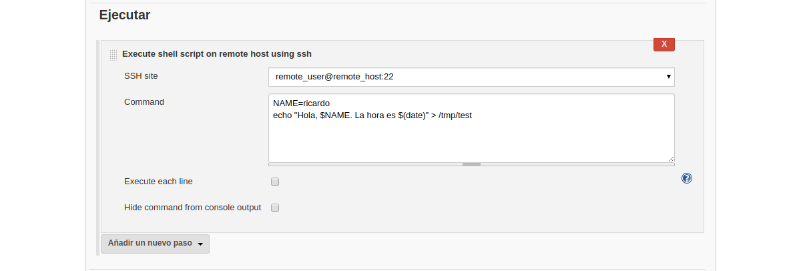
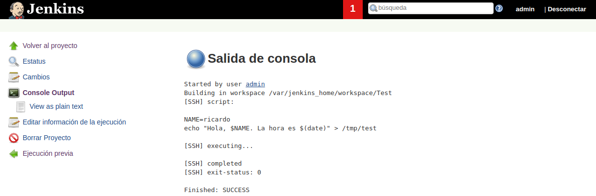

# Primer Job Host Remoto

---------------------------------------------------------

Creamos nuestra primera tarea, 


Creamos un primer proyecto de estilo libre, el cual tendrá:

* **shell sobre host remoto** escribiremos el siguiente código

```bash
NAME=ricardo
echo "Hola, $NAME. La hora es $(date)" > /tmp/test
```



Y si accedemos a la terminal de salida del job veremos que efectivamente se ejecuta correctamente el job.



Comprobemoslo, primero sobre el servicio de **jenkins**, y vemos que no se ejecutó.

```bash
demo@VirtualBox:~/Demo_Docker$ docker exec -ti jenkins bash
jenkins@594617c9c032:/$ cat /tmp/test
cat: /tmp/test: No such file or directory
jenkins@594617c9c032:/$ exit
exit
```

Y ahora sobre nuestro **host remoto**, para ver que efectivamente se ejecutó sobre nuestro **host remoto**.

```bash
demo@VirtualBox:~/Demo_Docker$ docker exec -ti remote-host bash
[root@865645b9cf44 /]# cat /tmp/test
Hola, ricardo. La hora es Thu Nov  1 11:47:50 UTC 2018
```

[Volver al Inicio](#primer-job-host-remoto)


