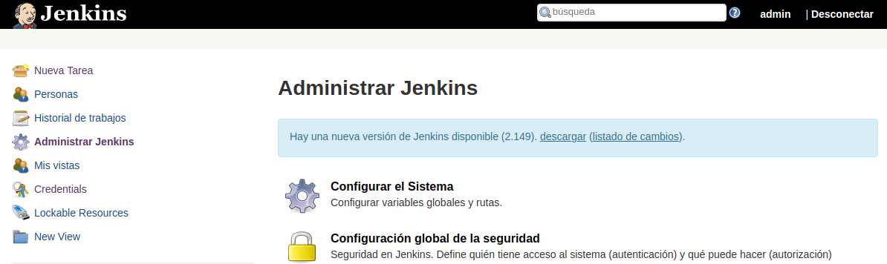

---------------------------------------------------------

### Job With Ansible

---------------------------------------------------------

#### Instalación básica inicial

Para ello crearemos nuestra carpeta **jenkins_home** dónde se alojara jenkins usando `mkdir jenkins_home` para posteriormente asignarle permisos mediante `chown 1000 -R jenkins_home` como usuario root (`sudo su`).

```bash
demo@VirtualBox:~/Demo_Docker$ mkdir jenkins_home

demo@VirtualBox:~/Demo_Docker$ sudo su
[sudo] password for demo:
root@hector-VirtualBox:/home/demo/jenkins-by-sample# chown 1000 -R jenkins_home
```

Una vez creada la carpeta, lanzaremos el servicio de jenkins con la configuración de [docker-compose.yml](./docker-compose.yml).

```bash
demo@VirtualBox:~/Demo_Docker$ docker-compose up -d
Starting jenkins ... done

demo@VirtualBox:~/Demo_Docker$ docker ps
CONTAINER ID IMAGE    COMMAND      CREATED   STATUS  PORTS     NAMES
7f41ec7f07ac jenkin.. "/sbin/t..." 55 se...  Up 3..  0.0....   jenkins
```


Partimos de la instalación inicial.



#### Permitir registro de usuarios