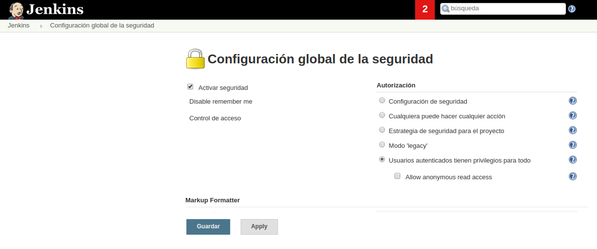
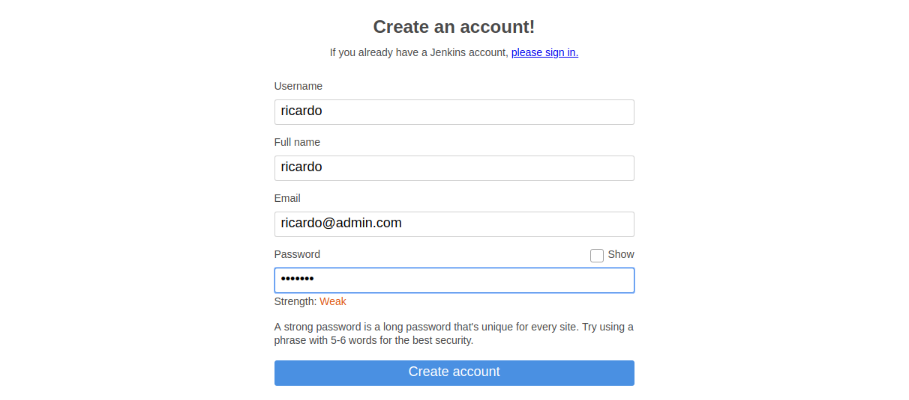

---------------------------------------------------------

### Job With Ansible

---------------------------------------------------------

#### Instalación básica inicial

Para ello crearemos nuestra carpeta **jenkins_home** dónde se alojara jenkins usando `mkdir jenkins_home` para posteriormente asignarle permisos mediante `chown 1000 -R jenkins_home` como usuario root (`sudo su`).

```bash
demo@VirtualBox:~/Demo_Docker$ mkdir jenkins_home

demo@VirtualBox:~/Demo_Docker$ sudo su
[sudo] password for demo:
root@hector-VirtualBox:/home/demo/jenkins-by-sample# chown 1000 -R jenkins_home
```

Una vez creada la carpeta, lanzaremos el servicio de jenkins con la configuración de [docker-compose.yml](./docker-compose.yml).

```bash
demo@VirtualBox:~/Demo_Docker$ docker-compose up -d
Starting jenkins ... done

demo@VirtualBox:~/Demo_Docker$ docker ps
CONTAINER ID IMAGE    COMMAND      CREATED   STATUS  PORTS     NAMES
7f41ec7f07ac jenkin.. "/sbin/t..." 55 se...  Up 3..  0.0....   jenkins
```

#### Seguridad Básica | acceso libre

Aunque no es para nada recomendable, podemos permitir el acceso a cualquier usuario sin una autentificación previa. Para elo accederemos a **Administrar Jenkins** >> **Configuración global de la seguridad**


Y desactivar la opción de **Activar seguiridad**.


Una vez hecho podríamos intentar acceder desde una nueva venta de incógnito para ver que:

* No es necesario loguearse.
* No aparece usuario autentificado.
* Aparece un mensaje de advertencia al estar el estado de la aplicación sin seguridad.


#### Permitir Registro de Usuarios

Para ello, accederemos a **Administrar Jenkins** >> **Configuración global de la seguridad**, dónde marcaremos la opción de **Activar seguiridad**, e indicaremos que queremos que la seguridad **Usará bae de datos de Jenkins**, más la opciónd de **registrarse a los usuarios**.


Además desmarcaremos la opción de que los **usuarios anónimos tengan acceso de lectura**



Ahora si volvemos acceder a jenkins en una nueva ventana de incógnito veremos que es necesario loguearse,y además aparece la opción de registro.




Si creamos el nuevo usuario y accedemos al **Dashboard** de **jenkins** veremos que este nuevo usuario tiene acceso a todo el contenido.


#### Permitir registro de usuarios

Para gestionar el acceso al distinto contenido de **Jenkins** usaremos un **plugin** llamado **Role-based Authorization Strategy**.

Para acceder a descargarlo entraremos en **Administrar Jenkins** >> **Administrar Plugins**, y seleccionaremos la pestaña de **Todos los plugins** para filtrar por el nombre del **plugin a instalar**.


Una vez se inicie la instalación, esperaremos a que acabe para marcar la opción de **Reiniciar Jenkins cuando termine la instalación**.


Ahora si accedemos nuevamente a **Administrar Jenkins** >> **Configuración global de la seguridad**, veremos que apareció una nueva sección (**Autorización**), en la cual marcaremos **Role-Based Strategy**


El siguiente paso consistirá en acceder a **Administrar Jenkins** >> **Manage and Assign Role** para gestionar los permisos de acceso.


#### Crear nuevos usuarios

Para crear nuevos usuarios accederemos a **Administrar Jenkins** >> **Gestión de usuarios**, para ver los usuarios actuales existentes.


Es aquí dónde podremos crear un nuevo usuario **mateo**.


#### Crear Nuevo Role

Para crear un nuevo role accederemos a **Administrar Jenkins** >> **Manage and Assign Role**, y seleccionaremos **Manage Roles**.


> **NOTA**: es necesario tener siempre el **Role Global de sólo lectura**

Nosotros crearemos un nuevo role con permisos de **sólo lectura**, que sólo puede **loguearse** y **ver los jobs**, modificando la configuración del role de **soloLectura**


Para tener acceso a los jobs deberemos asignar acceso de sólo lectura a las tareas.


* **¿Cómo asignar acceso a la ejecución de tareas?**

Para ello le asignaremos permisos de lectura, y leer y construir tareas.


#### Asignar Role

Para asignar un role accederemos a **Administrar Jenkins** >> **Manage and Assign Role**, y seleccionaremos **Assign Roles**.


Y posteriormente acceder a **Administrar Jenkins** >> **Manage and Assign Role**, seleccionar **Assign Roles** y asignarle un nuevo role de **solo lectura** a **ricardo**.


Ahora comprobamos los permisos de **ricardo accediendo a su perfil desde una ventana en incógnito, para ver que sólo tiene acceso de **soloLectura**.


#### Ejercicio - Crear usuarios y asignarle roles con distintos permisos.