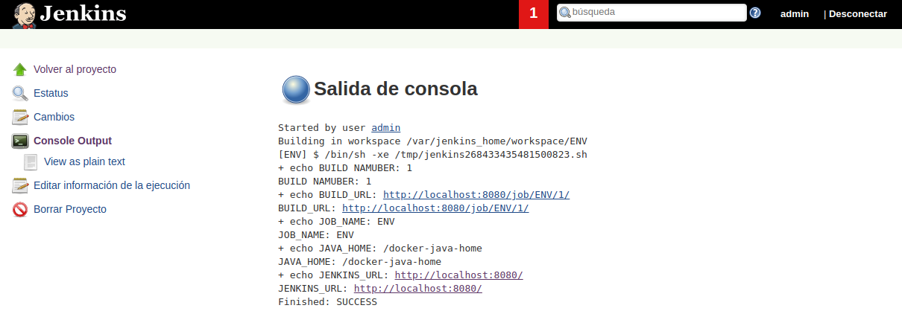
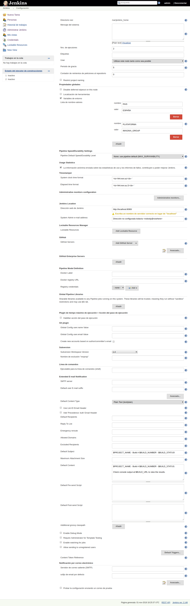
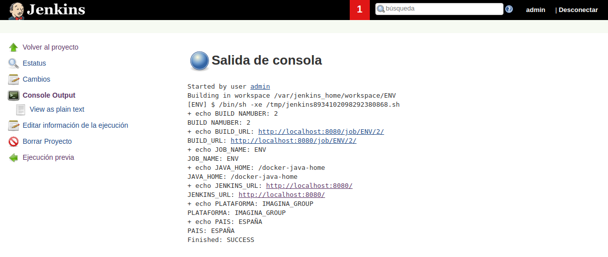
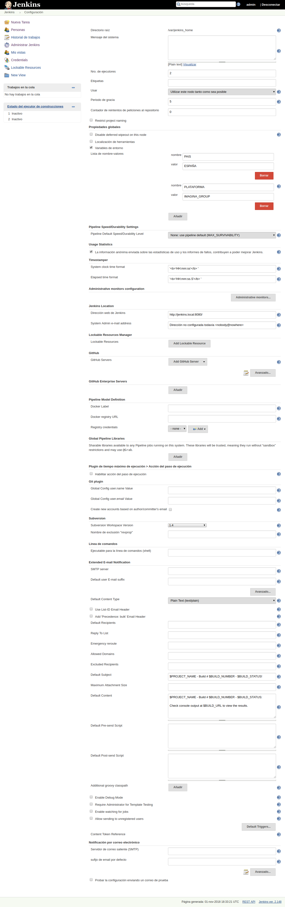

---------------------------------------------------------

### Tips & Ticks

---------------------------------------------------------

#### Instalación básica inicial

Para ello crearemos nuestra carpeta **jenkins_home** dónde se alojara jenkins usando `mkdir jenkins_home` para posteriormente asignarle permisos mediante `chown 1000 -R jenkins_home` como usuario root (`sudo su`).

```bash
demo@VirtualBox:~/Demo_Docker$ mkdir jenkins_home

demo@VirtualBox:~/Demo_Docker$ sudo su
[sudo] password for demo:
root@hector-VirtualBox:/home/demo/jenkins-by-sample# chown 1000 -R jenkins_home
```

Una vez creada la carpeta, lanzaremos el servicio de jenkins con la configuración de [docker-compose.yml](./docker-compose.yml).

```bash
demo@VirtualBox:~/Demo_Docker$ docker-compose up -d
Starting jenkins ... done

demo@VirtualBox:~/Demo_Docker$ docker ps
CONTAINER ID IMAGE    COMMAND      CREATED   STATUS  PORTS     NAMES
7f41ec7f07ac jenkin.. "/sbin/t..." 55 se...  Up 3..  0.0....   jenkins
```

#### Variables de Entorno de Jenkins

(Source: [https://wiki.jenkins.io/display/JENKINS/Building+a+software+project](https://wiki.jenkins.io/display/JENKINS/Building+a+software+project))

**Jenkins** ya trae por defecto una serie de variables de entorno.

En esta demo, crearemos una tarea de **estilo libre** que mediante la **shell** mostrará los valores de las diferentes variables de entorno de **Jenkins**.

```shell
echo BUILD NAMUBER: $BUILD_NUMBER
echo BUILD_URL: $BUILD_URL
echo JOB_NAME: $JOB_NAME
echo JAVA_HOME: $JAVA_HOME
echo JENKINS_URL: $JENKINS_URL
```

Guardaremos el **Jobs**, lo **construiremos** y veremos la salida **output**.



#### Crear Variables de Entorno Propias de Jenkins

Para crear nuestras propias variables de entorno accederemos a **Administrar Jenkins** >> **Configurar el Sistema**, y marcamos la opción de variables de entorno, dónde incluiremos las que necesitemos en nuestro proyecto.



Ahora accederemos a nuestra tarea de **estilo libre** para mediante la **shell** mostrar los valores de las diferentes variables de entorno de **Jenkins** creadas.

```shell
echo BUILD NAMUBER: $BUILD_NUMBER
echo BUILD_URL: $BUILD_URL
echo JOB_NAME: $JOB_NAME
echo JAVA_HOME: $JAVA_HOME
echo JENKINS_URL: $JENKINS_URL
echo PLATAFORMA: $PLATAFORMA
echo PAIS: $PAIS
```

Guardaremos el **Jobs**, lo **construiremos** y veremos la salida **output**.



#### Cambiar url Jenkins

Para ello acederemos a nuestro **Dashboard** de **Jenkins** para entrar en **Administrar Jenkins** >> **Configurar el Sistema**, y en la sección de **Jenkins Location** modificar la url.



Ahora deberemos agregar ese registro a nuestro hosts ubicado en **/home/etc/hosts** (Son necesarios permisos de administrador para guardar los cambios)

```diff
127.0.0.1	localhost
127.0.1.1	hector-VirtualBox

# The following lines are desirable for IPv6 capable hosts
::1     ip6-localhost ip6-loopback
fe00::0 ip6-localnet
ff00::0 ip6-mcastprefix
ff02::1 ip6-allnodes
ff02::2 ip6-allrouters
++ 127.0.0.1 jenkins.local
```
