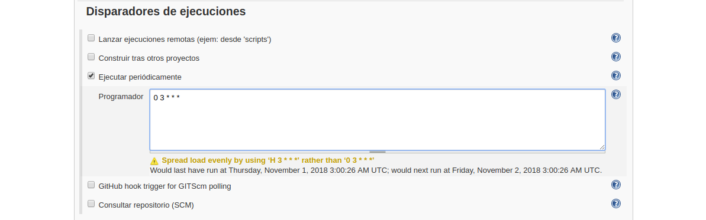
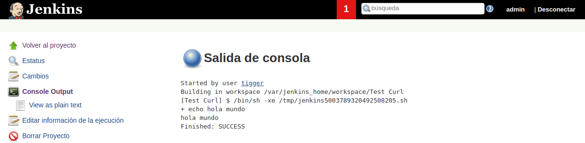

# Tips & Ticks

---------------------------------------------------------

## INSTALACIÓN BÁSICA INICIAL

---------------------------------------------------------

Para ello crearemos nuestra carpeta **jenkins_home** dónde se alojara jenkins usando `mkdir jenkins_home` para posteriormente asignarle permisos mediante `chown 1000 -R jenkins_home` como usuario root (`sudo su`).

```bash
demo@VirtualBox:~/Demo_Docker$ mkdir jenkins_home

demo@VirtualBox:~/Demo_Docker$ sudo su
[sudo] password for demo:
root@hector-VirtualBox:/home/demo/jenkins-by-sample# chown 1000 -R jenkins_home
```

Una vez creada la carpeta, lanzaremos el servicio de jenkins con la configuración de [docker-compose.yml](./docker-compose.yml).

```bash
demo@VirtualBox:~/Demo_Docker$ docker-compose up -d
Starting jenkins ... done

demo@VirtualBox:~/Demo_Docker$ docker ps
CONTAINER ID IMAGE    COMMAND      CREATED   STATUS  PORTS     NAMES
7f41ec7f07ac jenkin.. "/sbin/t..." 55 se...  Up 3..  0.0....   jenkins
```

[Volver al Inicio](#tips--ticks)


## VARIABLES DE ENTORNO EN JENKINS

---------------------------------------------------------

(Source: [https://wiki.jenkins.io/display/JENKINS/Building+a+software+project](https://wiki.jenkins.io/display/JENKINS/Building+a+software+project))

**Jenkins** ya trae por defecto una serie de variables de entorno.

En esta demo, crearemos una tarea de **estilo libre** que mediante la **shell** mostrará los valores de las diferentes variables de entorno de **Jenkins**.

```shell
echo BUILD NAMUBER: $BUILD_NUMBER
echo BUILD_URL: $BUILD_URL
echo JOB_NAME: $JOB_NAME
echo JAVA_HOME: $JAVA_HOME
echo JENKINS_URL: $JENKINS_URL
```

Guardaremos el **Jobs**, lo **construiremos** y veremos la salida **output**.


[Volver al Inicio](#tips--ticks)


## CREAR VARIABLES DE ENTORNO PROPIAS EN JENKINS

---------------------------------------------------------

Para crear nuestras propias variables de entorno accederemos a **Administrar Jenkins** >> **Configurar el Sistema**, y marcamos la opción de variables de entorno, dónde incluiremos las que necesitemos en nuestro proyecto.


Ahora accederemos a nuestra tarea de **estilo libre** para mediante la **shell** mostrar los valores de las diferentes variables de entorno de **Jenkins** creadas.

```shell
echo BUILD NAMUBER: $BUILD_NUMBER
echo BUILD_URL: $BUILD_URL
echo JOB_NAME: $JOB_NAME
echo JAVA_HOME: $JAVA_HOME
echo JENKINS_URL: $JENKINS_URL
echo PLATAFORMA: $PLATAFORMA
echo PAIS: $PAIS
```

Guardaremos el **Jobs**, lo **construiremos** y veremos la salida **output**.


[Volver al Inicio](#tips--ticks)


## CAMBIAR URL DE REFERENCIA DE JENKINS

---------------------------------------------------------

Para ello acederemos a nuestro **Dashboard** de **Jenkins** para entrar en **Administrar Jenkins** >> **Configurar el Sistema**, y en la sección de **Jenkins Location** modificar la url.


Ahora deberemos agregar ese registro a nuestro hosts ubicado en **/home/etc/hosts** (Son necesarios permisos de administrador para guardar los cambios)

```diff
127.0.0.1	localhost
127.0.1.1	hector-VirtualBox

# The following lines are desirable for IPv6 capable hosts
::1     ip6-localhost ip6-loopback
fe00::0 ip6-localnet
ff00::0 ip6-mcastprefix
ff02::1 ip6-allnodes
ff02::2 ip6-allrouters
++ 127.0.0.1 jenkins.local
```

[Volver al Inicio](#tips--ticks)


## CONSTRUIR JOBS CON CRON

---------------------------------------------------------

Esto permite programar cada Jobs para que se ejecute en un momento determinado. Para ello accederemos a la configuración de la tarea que queremos programar en la sección de **Disparadores de ejecuciones**.



> **NOTA**: este sistema de programación utiliza el formato **CRON**, para evitar aprenderlo podemos usar el conversor siguiente [https://crontab.guru/](https://crontab.guru/)

Para evitar colisiones entre Jobs, podemos sustituir el primer cero de la programación por **H** para que **Jenkins** puede decidir en que instante dentro de esa hora puede lanzar el jobs para evitar colisiones.

[Volver al Inicio](#tips--ticks)


## EJERCICIO - Programar nuevas ejecuciones.

---------------------------------------------------------

[Volver al Inicio](#tips--ticks)


## CONSTRUIR JOBS DESDE UN SCRIPT - Sin parámetros

---------------------------------------------------------

> **NOTA**: Para ello es necesario tener un usuario con un role que le permita solo **leer** y **ejecutar jobs**. No olvidar **incluir** permisos de **lectura Global**.

Una vez creado el usuario con el role que lance los **Jobs**, usaremos **curl** para lanzarlos.

Deberemos activar el módulo dentro de **Administrar Jenkins** >> **Configuración Global de la Seguridad**, en la sección de **CSRF Protection** (la cual protege la aplicación de ataques externos y deberá estar activa)


Ahora generaremos nuestro **script** que lance la ejecución.
Este dispondrá del nombre del contenedor al que llamar `jenkins` y el passwor de acceso al mismo `tigger`, `tigger:tigger`, más la url de acceso a **crumb**. con nuestro dominio, en este caso `localhost:8080`.

A continuación incluirá la url del **job** a construir que resultaría de la url de construcción del mismo `http://localhost:8080/job/test-curl/build?delay=0sec`.

```sh
crumb=$(curl -u "tigger:tigger" -s 'http://localhost:8080/crumbIssuer/api/xml?xpath=concat(//crumbRequestField,":",//crumb)')
curl -u "tigger:tigger" -H "$crumb" -X POST http://localhost:8080/job/test-curl/build?delay=0sec
``` 

> **IMPOTANTE** es necesario otorgar permisos de ejecución al script usando `chmod +x crumb.sh`

Ahora si ejecutamos el script en consola `./crumb.sh`, previa asignación de permisos de ejecución `./chmod +x crumb.sh`, se construirá nuevamente el job.

Podemos ver en terminal de jenkins quien lanzó el jobs.



[Volver al Inicio](#tips--ticks)


## CONSTRUIR JOBS DESDE UN SCRIPT - Con parámetros

---------------------------------------------------------

Para incluir un job con parmateros capturaremos la url del job seguida de `//buildWithParameters?`, más los parámetros con los valores que deseemos incluir.

```sh
crumb=$(curl -u "tigger:tigger" -s 'http://localhost:8080/crumbIssuer/api/xml?xpath=concat(//crumbRequestField,":",//crumb)')
curl -u "tigger:tigger" -H "$crumb" -X POST http://localhost:8080/job/test-curl/build?delay=0sec
curl -u "tigger:tigger" -H "$crumb" -X POST http://localhost:8080/job/test-curl-con-parametros/buildWithParameters?NAME=manolo&LASTNAME=garcia
``` 

Podemos ver en terminal de jenkins quien lanzó el jobs.


[Volver al Inicio](#tips--ticks)