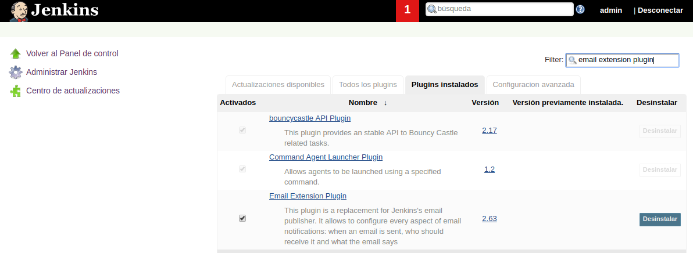
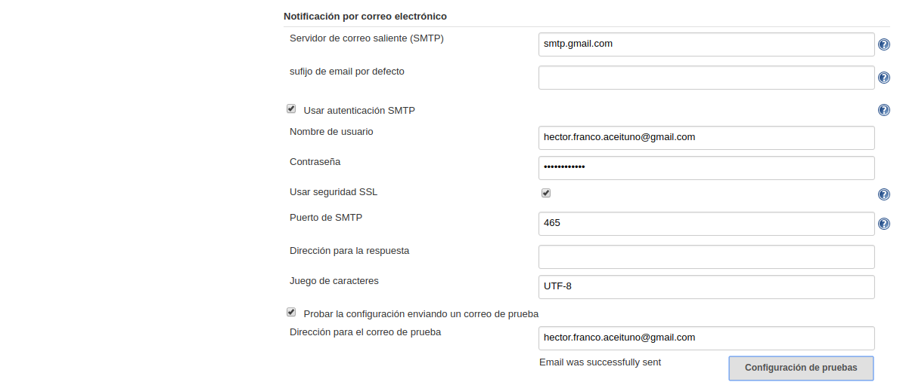
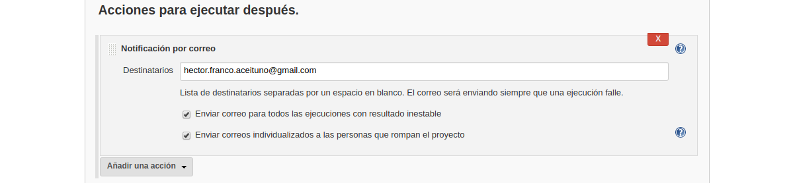
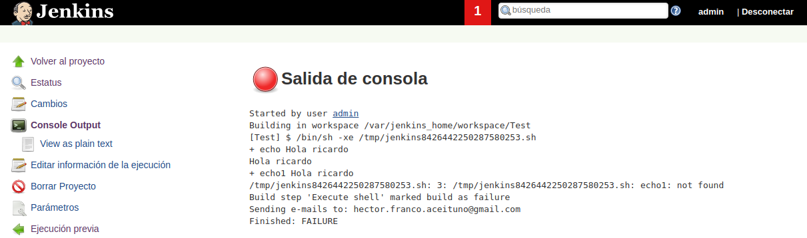

---------------------------------------------------------

### Emails

---------------------------------------------------------

#### Instalación básica inicial

Para ello crearemos nuestra carpeta **jenkins_home** dónde se alojara jenkins usando `mkdir jenkins_home` para posteriormente asignarle permisos mediante `chown 1000 -R jenkins_home` como usuario root (`sudo su`).

```bash
demo@VirtualBox:~/Demo_Docker$ mkdir jenkins_home

demo@VirtualBox:~/Demo_Docker$ sudo su
[sudo] password for demo:
root@hector-VirtualBox:/home/demo/jenkins-by-sample# chown 1000 -R jenkins_home
```

Una vez creada la carpeta, lanzaremos el servicio de jenkins con la configuración de [docker-compose.yml](./docker-compose.yml).

```bash
demo@VirtualBox:~/Demo_Docker$ docker-compose up -d
Starting jenkins ... done

demo@VirtualBox:~/Demo_Docker$ docker ps
CONTAINER ID IMAGE    COMMAND      CREATED   STATUS  PORTS     NAMES
7f41ec7f07ac jenkin.. "/sbin/t..." 55 se...  Up 3..  0.0....   jenkins
```

#### Notificaciones con Jenkins vía Email

Para llevar a cabo las notificaciones vía email, es necesrio incluir el **plugin mailer**. Este plugin suele venir instalado por defecto, para comporbarlo accederemos a **Administrar Jenkins** >> **Gestor de Plugins**.

Para este ejemplo usaremos notificaciones a una cuenta de gmail.



Buscamos la configuración smtp de google (**smtp gmail settings**) [https://support.google.com/a/answer/176600?hl=en](https://support.google.com/a/answer/176600?hl=en)

Y accedemos a **Administrar Jenkins** >> **Configurar el Sistema**, en la sección de **Notificación por correo electrónico**.



Y abrimos nuestra cuenta de gmail (**aplicaciones menos seguras gmail**) [https://support.google.com/accounts/answer/6010255?hl=es](https://support.google.com/accounts/answer/6010255?hl=es), ya que por defecto gmail bloqueará el correo.

Posteriormente podremos probar el envío del correo en la opción habilitada.

#### Integrar Notificaciones en Nuestros Jobs

Para integrarlo incluimos dentro de la configuración del Job en la sección de **Acciones para ejecutar después** la opción de enviar el correo a una determinada dirección.



Para testear el funcionamiento provocaremos un error intencionalmente dentro de la sheel de jenkins.

Si vemos la salida de consola, se nos informará de un error y el envío de un email a cierto correo electrónico designado.



> **NOTA**: Si corrigiesemos el error y volviésemos a construir el job, se nos notificaría que el Job volvió a su normalidad.


