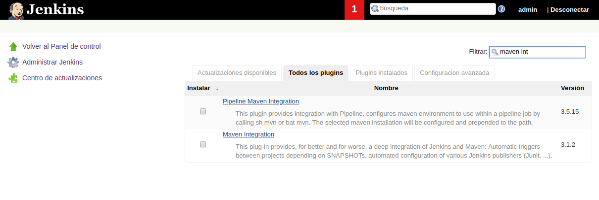
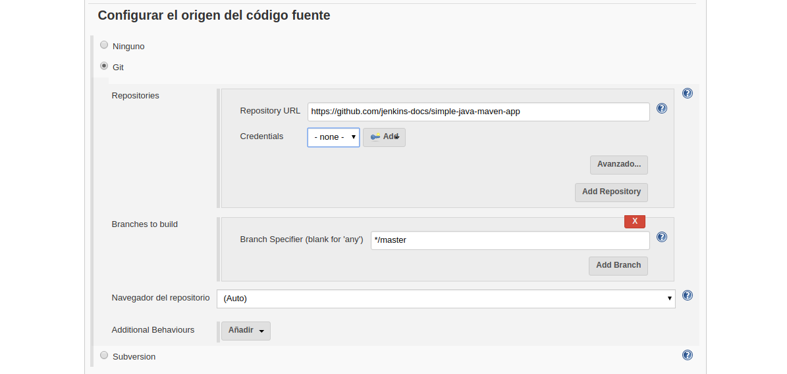
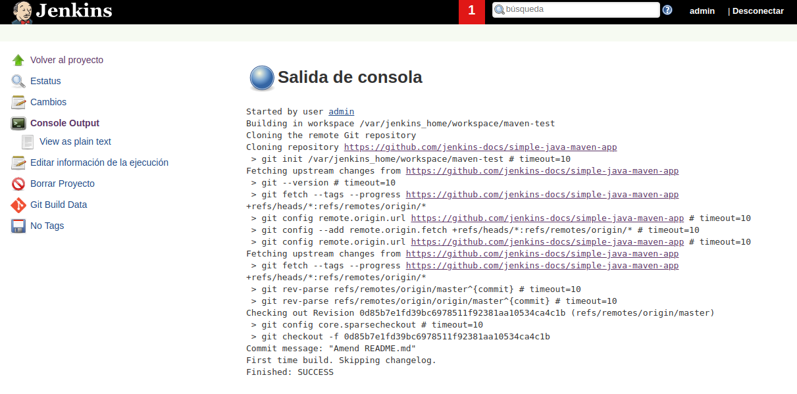

---------------------------------------------------------

### Maven

---------------------------------------------------------

#### Instalación básica inicial

Para ello crearemos nuestra carpeta **jenkins_home** dónde se alojara jenkins usando `mkdir jenkins_home` para posteriormente asignarle permisos mediante `chown 1000 -R jenkins_home` como usuario root (`sudo su`).

```bash
demo@VirtualBox:~/Demo_Docker$ mkdir jenkins_home

demo@VirtualBox:~/Demo_Docker$ sudo su
[sudo] password for demo:
root@hector-VirtualBox:/home/demo/jenkins-by-sample# chown 1000 -R jenkins_home
```

Una vez creada la carpeta, lanzaremos el servicio de jenkins con la configuración de [docker-compose.yml](./docker-compose.yml).

```bash
demo@VirtualBox:~/Demo_Docker$ docker-compose up -d
Starting jenkins ... done

demo@VirtualBox:~/Demo_Docker$ docker ps
CONTAINER ID IMAGE    COMMAND      CREATED   STATUS  PORTS     NAMES
7f41ec7f07ac jenkin.. "/sbin/t..." 55 se...  Up 3..  0.0....   jenkins
```

#### Maven

Imaginemos que tenemos un repositorio con código en **Java** y queremos descargarlo para que posteriormente **Jenkins** construya un **.jar** con maiven que será testeado mediante **pruebas unitarias** para finalmente desplegarlo.

Para instalar el plugin de **Maiven** accederemos a **Administrar Jenkins** >> **Gestor de Plugins**, y lo buscaremos como **Maiven Integration**.



Para instalar el plugin de **Git** accederemos a **Administrar Jenkins** >> **Gestor de Plugins**, y lo buscaremos como **Git** dentro de plugins instalados (este plugin se instala por defecto).

#### Hacer pull desde un repo en Git/Github

Creamos una nueva tarea de estilo libre y dentro de su configuración accedemos a la sección de **configurar el origen de código fuente**.

Aquí incluiremos la url del repositorio, más si fuera privado las **credenciales de acceso**, y la rama del repositorio. Nosotros hemos elegido un repositorio de ejemplo de github [https://github.com/jenkins-docs/simple-java-maven-app](https://github.com/jenkins-docs/simple-java-maven-app)



Posteriormente **construiremos** nuestro **job** y podremos ver nuestra salida en la terminal de **jenkins**.



**Jenkins** crea **workspace** dónde guarda el estado de cada repositorio.

**¿Dónde se clona el repositorio?** El repositorio se habrá clonado dentro de una carpeta **workspace** con el **nombre del jobs**.

```bash
demo@VirtualBox:~/Demo_Docker$ docker ps docker exec -ti jenkins bash

jenkins@8e467834c810:/$ cd /var/jenkins_home/workspace/maven-test
jenkins@8e467834c810:~/workspace/maven-test$ ls
README.md  jenkins  pom.xml  src
```

#### Construir código con Maven