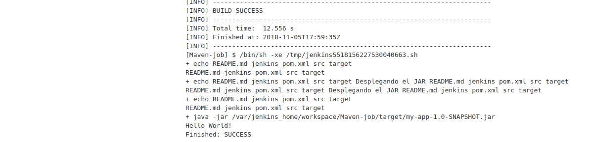

# Maven

---------------------------------------------------------

## INSTALACIÓN BÁSICA INICIAL

---------------------------------------------------------

Para ello crearemos nuestra carpeta **jenkins_home** dónde se alojara jenkins usando `mkdir jenkins_home` para posteriormente asignarle permisos mediante `chown 1000 -R jenkins_home` como usuario root (`sudo su`).

```bash
demo@VirtualBox:~/Demo_Docker$ mkdir jenkins_home

demo@VirtualBox:~/Demo_Docker$ sudo su
[sudo] password for demo:
root@hector-VirtualBox:/home/demo/jenkins-by-sample# chown 1000 -R jenkins_home
```

Una vez creada la carpeta, lanzaremos el servicio de jenkins con la configuración de [docker-compose.yml](./docker-compose.yml).

```bash
demo@VirtualBox:~/Demo_Docker$ docker-compose up -d
Starting jenkins ... done

demo@VirtualBox:~/Demo_Docker$ docker ps
CONTAINER ID IMAGE    COMMAND      CREATED   STATUS  PORTS     NAMES
7f41ec7f07ac jenkin.. "/sbin/t..." 55 se...  Up 3..  0.0....   jenkins
```

[Volver al Inicio](#maven)


## INSTALANDO MAVEN

---------------------------------------------------------

Imaginemos que tenemos un repositorio con código en **Java** y queremos descargarlo para que posteriormente **Jenkins** construya un **.jar** con maiven que será testeado mediante **pruebas unitarias** para finalmente desplegarlo.

Para instalar el plugin de **Maven** accederemos a **Administrar Jenkins** >> **Gestor de Plugins**, y lo buscaremos como **Maven Integration**.


Para instalar el plugin de **Git** accederemos a **Administrar Jenkins** >> **Gestor de Plugins**, y lo buscaremos como **Git** dentro de plugins instalados (este plugin se instala por defecto).

[Volver al Inicio](#maven)


## CÓMO HACER PULL DESDE UN REPOSITORIO EN GITHUB

---------------------------------------------------------

Creamos una nueva tarea de estilo libre y dentro de su configuración accedemos a la sección de **configurar el origen de código fuente**.

Aquí incluiremos la url del repositorio, más si fuera privado las **credenciales de acceso**, y la rama del repositorio. Nosotros hemos elegido un repositorio de ejemplo de github [https://github.com/jenkins-docs/simple-java-maven-app](https://github.com/jenkins-docs/simple-java-maven-app) (Resultado de la búsqueda en Google de los términos **Simple Java Maven App**)

> **NOTA**: Es necesario seleccionar el branch utilizado.


Posteriormente **construiremos** nuestro **job** y podremos ver nuestra salida en la terminal de **jenkins**.


**Jenkins** crea un **workspace** dónde guarda el estado de cada repositorio.

**¿Dónde se clona el repositorio?** El repositorio se habrá clonado dentro de una carpeta **workspace** con el **nombre del jobs**.

```bash
demo@VirtualBox:~/Demo_Docker$ docker exec -ti jenkins bash

jenkins@8e467834c810:/$ cd /var/jenkins_home/workspace/Maven-job
jenkins@8e467834c810:~/workspace/Maven-job$ ls
README.md  jenkins  pom.xml  src
```

> **NOTA**: En la última línea la ubicación, `/Maven-job/`hace referencia al nombre del **Job** elegido.

[Volver al Inicio](#maven)


## CONSTRUIR CÓDIGO CON MAVEN

---------------------------------------------------------

Es momento de Configurar el plugin de **Maven** que descargamos. 

Para ello accederemos a **Administrar Jenkins** >> **Global Tool Configuration**.


Y dentro de la sección **Maven** accedemos a la opción **Añadir Maven**, dónde colocaremos un nombre arbitrario como por ejemplo **jenkins_maven** y la versión a instalar.


> **NOTA**: No olvidar guardar la configuración.

Ahora accedemos a la configuración del **job** en la parte de **ejecutar** seleccionamos la opción de **ejecutar tareas Maven de nivel superior**. Nos preguntará por la **versión de maven**, y en **Goals** seleccionaremos que queremos hacer con **Maven** (que nos entregue un **.jar**, `-B -DskipTests clean package`)


Guardamos el **job** y lo construimos.

> **NOTA**: Esto tardará unos minutos puesto que tiene que descargar **Maven**.
> **NOTA**: Al construir el proycto **jenkins** comprobará si su versión del repo está actualizada y construirá el **.jar**.

Si accedemos a consola veremos como resolvió el **job** jenkins.


**¿Dónde guarda Jenkins el archivo generado?** Lo guardará dentro del **workspace** creado para el **job**. Lo habrá guardado dentro de [/jenkins_home/workspace/Maven-job/target/my-app-1.0-SNAPSHOT.jar](~/jenkins_home/workspace/Maven-job/target/my-app-1.0-SNAPSHOT.jar).


> **NOTA**: En la última línea la ubicación, `/Maven-job/`hace referencia al nombre del **Job** elegido.

[Volver al Inicio](#maven)


## REALIZAR TEST SOBRE NUESTRO ARTEFACTO CONSTRUIDO

---------------------------------------------------------

El flujo de trabajo sería : **Descargar el código fuente** -> **generar el artefacto (construir el .jar** -> **Hacer Test**.

Si accedemos a la carpeta del proyecto, dónde se generó el **.jar** veremos que tenemos una carpeta llamada **test-classes**, dentro tendremos una serie de test que vienen con este ejemplo de **Maven**.

> **NOTA**: Estos Test deben ser generados por especialistas en Test Unitarios, no vienen ni se generan por defecto.

Para ejecutarlos accederemos a la configuración del **job** y en la sección de **Ejecutar** crearemos otra nueva tarea **maven nivel superior**.


**Guardamos** la nueva configuración del **job** y lo **construimos**. Esto volvería a descargar el repositorio (o comprobar que está actualizado), generar el artefacto (**.jar**) y ejecuta los test definidos en el proyecto.

Si accedemos a la terminal veremos la sigueinte salida. Veremos que se han generado dos test satisfactoriamente. 


**¿Dónde encontaremos los resultados detallados de los test?** Estos test se guardan dentro de [/jenkins_home/workspace/Maven-job/target/surefire-reports](~/jenkins_home/workspace/Maven-job/target/surefire-reports) con formato **.xml**.

> **NOTA**: En la última línea la ubicación, `/Maven-job/`hace referencia al nombre del **Job** elegido.

**RESUMIENDO: Hasta ahora, hemos bajado el código lo hemos compilado y finalmente hemos testeado que funcione correctamente.**

[Volver al Inicio](#maven)


## COMO DESPLEGAR LOCALMENTE EL JAR GENERADO

---------------------------------------------------------

Recordemos que el jar se generó en [/jenkins_home/workspace/Maven-job/target/my-app-1.0-SNAPSHOT.jar](~/jenkins_home/workspace/Maven-job/target/my-app-1.0-SNAPSHOT.jar), nuestro sigueinte paso consistirá en desplegar el **.jar** generado localmente, lo cual haremos con un simple comando de consola **shell** en **jenkins**.


_**Shel jenkins**_
```shell
echo **********************
echo * Desplegando el JAR *
echo **********************

java -jar /var/jenkins_home/workspace/Maven-job/target/my-app-1.0-SNAPSHOT.jar
```

> **NOTA**: En la última, línea la ubicación, `/Maven-job/`hace referencia al nombre del **Job** elegido.



**RESUMIENDO: Hasta ahora, hemos bajado el código lo hemos compilado, hemos testeado que funcione correctamente, y finalmente lo hemos ejecutado.**

[Volver al Inicio](#maven)


## COMO PODEMOS ALMACENAR LA INFORMACIÓN DE LOS TEST UNITARIOS

---------------------------------------------------------

Debemos poder almacenar nuestros test para evaluar la evolución de los test realizados, ¿Cuantos test fallan? ¿Cada cuanto?...

Para ello dentro de la configuración de nuestro **job** accedemos a la sección de **Acciones para ejecutar después** dónde seleccionaremos la opción de **publicar los resultados de los test JUnit**.

Aquí tendremos que indicar dentro del **workspace** del **job** la ubicación de los archivos **.xml** resultantes de los **test unitarios** realizados.


Accedemos a la terminal y al final veremos que los resultados de los test fueron guardados. Ahora dentro del **job** veremos una opción nueva llamada **Resultados de los test** si accedemos veremos lo siguiente.

> **NOTA**: Después de varias construcciones apreciaremos dentro de la pantalla principal del **job** una gráfica con los últimos resultados y sus datos más relevantes.


**RESUMIENDO: Hasta ahora, hemos bajado el código lo hemos compilado, hemos testeado que funcione correctamente, lo hemos ejecutado, y ahora podemos ver los resultados relativos a los test realizados hasta el momento**

[Volver al Inicio](#maven)


## COMO ARCHIVAR LOS ARTIFACTS EN TU JOB

---------------------------------------------------------

En este apartado capturaremos el último **.jar** que se generó con éxito para mostarrlo.

Para ello dentro de la configuración de nuestro **job** accedemos a la sección de **Acciones para ejecutar después** dónde seleccionaremos la opción de **guardar los ficheros generados**.

Una vez seleccionada esta acción indicaremos la ubicación de los archivos generados que queremos guaradr [target/*.jar](./target/*.jar) (referenciados con respecto a nuestro **workspace** dedicado al **job**), y seleccionaremos la opción de guardarlos sólo cuando hayan resultado satisfactorios.


Una vez configurado el **job** guardaremos la configuración y lo construiremos nuevamente. Ahora, dentro del **dashboard** del **job** veremos que podemos descargar dicho **.jar** generado en la última construcción.


**RESUMIENDO: Hasta ahora, hemos bajado el código lo hemos compilado, hemos testeado que funcione correctamente, lo hemos ejecutado, podemos ver los resultados relativos a los test realizados hasta el momento, y podemos archivar los .jar generados**

[Volver al Inicio](#maven)


## CONFIGURAR NOTIFICACIONES DEL ESTADO DE LOS JOBS VÍA EMAIL

---------------------------------------------------------

Para ello accederemos a la configuración del **job** en la parte de **acciones para ejecutar después**, dónde indicaremos una nueva **notificación por correo**.


> **NOTA**: Para este ejemplo haremos que falle de forma intencionada el **job** guardamos y lo construimos. Corregimos el **job** y lo volvemos a construir. Durante este proceso recibiremos dos **emails con notificaciones**.