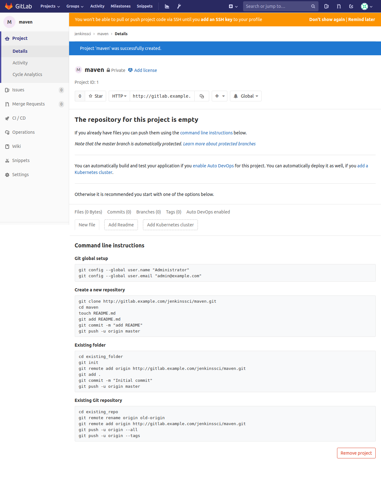

# Jenkins GIT

---------------------------------------------------------

## INSTALACIÓN BÁSICA INICIAL

---------------------------------------------------------

Para ello crearemos nuestra carpeta **jenkins_home** dónde se alojara jenkins usando `mkdir jenkins_home` y `mkdir db_data` para posteriormente asignarle permisos mediante `chown 1000 -R jenkins_home` y `chown 1000 -R db_data` como usuario root (`sudo su`).

```bash
demo@VirtualBox:~/Demo_Docker$ mkdir jenkins_home

demo@VirtualBox:~/Demo_Docker$ sudo su
[sudo] password for demo:
root@hector-VirtualBox:/home/demo/jenkins-by-sample# chown 1000 -R jenkins_home
```

Una vez creada la carpeta, lanzaremos el servicio de jenkins con la configuración de [docker-compose.yml](./docker-compose.yml).

```bash
demo@VirtualBox:~/Demo_Docker$ docker-compose up -d
Starting jenkins ... done

demo@VirtualBox:~/Demo_Docker$ docker ps
CONTAINER ID IMAGE    COMMAND      CREATED   STATUS  PORTS     NAMES
7f41ec7f07ac jenkin.. "/sbin/t..." 55 se...  Up 3..  0.0....   jenkins
```

[Volver al Inicio](#jenkins-git)


## INSTALAR GIT SERVER

---------------------------------------------------------

Ahora aprenderemos a cear un **server GIT** para **jenkins**. Para ello accederemos a **GitLab Docs** (Búsqueda en **google**: **Gitlab CE docker**, [https://docs.gitlab.com/omnibus/docker/](https://docs.gitlab.com/omnibus/docker/))

Para ello a partir de esa documentación añadiremos un nuevo servicio a nuestro **docker-compose.yml**.

_[docker-compose.yml](./docker-compose.yml)_
```diff
version: '3'
services:
  jenkins:
    # ...
  remote_host:
    # ...
  db_host:
    # ...
  web:
    # ...
    ports:
--    - "80:80"  
++    - "8888:80"   
    # ...      
++ git:
++   container_name: git-server
++   hostname: gitlab.example.com
++   ports:
++     - "443:443"
++     - "80:80"
++   volumes:
++     - "/srv/gitlab/config:/etc/gitlab"
++     - "/srv/gitlab/logs:/var/log/gitlab"
++     - "/srv/gitlab/data:/var/opt/gitlab"
++   image: gitlab/gitlab-ce
++   networks:
++     - net
networks:
  net:
```

> **NOTA**: Veremos que existirá un conflicto con respecto a los puertos utilizados por la máquina entre el servicio **web** y el servicio **git**, por ello habrá que modificarlo.

> **NOTA**: Los volúmenes guardaran la información dentro de nuestra máquina.
> **NOTA**: Utilizaremos la imagen referenciada en la documentación.

Una vez actualizado el [docker-compose.yml](./docker-compose.yml), podremos ejecutar el comando de consola `docker-compose up -d` para levantar el servicio.

> **NOTA**: Este proceso se demorará unos minutos ya que la descarga de **gitlab** es muy pesada (más de 1gb). Para ver la evolución de la carga de **gitLab** ejecutaremos el comando `docker logs -f git-server` (si se quedase bloqueado *ctrl+c* y nuevamente `docker logs -f git-server`)

Ahora accederemos a la ubicación [http://localhost:80/](http://localhost:80/)


En esa nueva página se nos pedirá que incluyamos nuestro password (Usaremos **admin_admin**). Y a continuación logueamos con el usuaro **root** y el password anteriormente definido.


Ahora tendríamos nuestro **GitLab server** creado.


[Volver al Inicio](#jenkins-git)


## CREAR REPOSITORIO GITLAB

---------------------------------------------------------

Primeramente generaremos nuestro **hostname** definido dentro de **docker-compose.yml** ( **gitlab.example.com** ), para ello accedemos a [/etc/hosts](/etc/hosts) como usuario root (`sudo su`).

_[/etc/hosts](/etc/hosts)_
```diff
127.0.0.1	localhost
127.0.1.1	hector-VirtualBox
++ 127.0.0.1   gitlab.example.com
# The following lines are desirable for IPv6 capable hosts
::1     ip6-localhost ip6-loopback
fe00::0 ip6-localnet
ff00::0 ip6-mcastprefix
ff02::1 ip6-allnodes
ff02::2 ip6-allrouters
```

Si accedemos a [gitlab.example.com](gitlab.example.com), podremos acceder al **servidor de GitLab**, y accedemos con el usuario **root** con el password **admin_admin**.


Y seleccionamos **Crear un nuevo grupo**, cuyo **group path** será **jenkinsci**.


> **NOTA**: Un Grupo en **GitLab** es una colección de **proyectos**.

Por ello, pulsaremos en la opción de **crear un nuevo proyecto**.


Y designamos como **nombre de proyecto** (**project slug**), **maven**.


Y pulsamos en guardar el nuevo proyecto creado.



**YA HEMOS CREADO NUESTRO GRUPO, CON NUESTRO PROYECTO MAVEN, AHORA EMPEZAREMOS A INCLUIR ARCHIVOS EN EL REPOSITORIO**

[Volver al Inicio](#jenkins-git)


## CREAR UN USUARIO EN GIT CON PERMISOS SOBRE EL REPOSITORIO

---------------------------------------------------------

Ahora accedemos a la **configuración** de **gitlab** (**llave inglesa**), en **Overview** > **Users** y **new user**.


Y completamos la información del usuario para posteriormente guardarlo (user: imaginaGroup)


Una vez creado el usuario, seleccionaremos la opción de **editar** para definir la contraseña (password: 87654321) del mismo y guardamos el usuario.


Ahora accedemos a **Overview** > **proyectos** en el proyecto que queremos que dicho usuario tenga permisos de acceso (**jenkins/maven**).


Y en la opción de **manage access**.


Dentro **Seleccionaremos el miembro** al que queremos invitar al grupo, más el **role permission**, en nuestro caso **developer**, y salvamos la invitación.


[Volver al Inicio](#jenkins-git)


## AGREGAR CÓDIGO JAVA EN EL REPOSITORIO

---------------------------------------------------------

Para clonar el repositorio primeramente accederemos a la terminal del contenedor de **jenkins**, `docker exec -u root -ti jenkins bash`.

Y accedemos dentro de **gitLab server** en el proyecto de **maven** para clonar el repositorio (seleccionamos el comando `git clone http://gitlab.example.com/jenkinssci/maven.git`) y lo ejecutamos en la carpeta de nuestro proyecto.


```bash
demo@VirtualBox:~/Demo_Docker$ git clone http://gitlab.example.com/jenkinssci/maven.git
Cloning into 'maven'...
Username for 'http://gitlab.example.com': root
Password for 'http://root@gitlab.example.com':
warning: You appear to have cloned an empty repository.
```

Se nos infomra que el repositorio descargado está vacío, por lo que para cargar contenido accederemos al repositorio de la demo de **maven** para clonarlo `git clone https://github.com/jenkins-docs/simple-java-maven-app`

```bash
demo@VirtualBox:~/Demo_Docker$ git clone https://github.com/jenkins-docs/simple-java-maven-app
Cloning into 'simple-java-maven-app'...
remote: Enumerating objects: 88, done.
remote: Total 88 (delta 0), reused 0 (delta 0), pack-reused 88
Unpacking objects: 100% (88/88), done.
```

Ahora tenemos dos repositorios en nuestra carpeta del proyecto. Así, que copiamos el contenido del repositorio **simple-java-maven-app** hacia el de **maven** mediante el comando `$ cp simple-java-maven-app/* maven/ -r`.

```bash
demo@VirtualBox:~/Demo_Docker$ cp simple-java-maven-app/* maven/ -r
```

Si accedemos a la carpeta de **maven** podremos ver nuestro repositorio de **gitlab server**. 

```bash
demo@VirtualBox:~/Demo_Docker$ cd maven
demo@VirtualBox:~/Demo_Docker$ ls
```

Y visualizar el estado del repositorio, `git status`.

```bash
demo@VirtualBox:~/Demo_Docker/maven$ git status
On branch master
No commits yet
Untracked files:
  (use "git add <file>..." to include in what will be committed)
        README.md
        jenkins/
        pom.xml
        src/
nothing added to commit but untracked files present (use "git add" to track)
```

Añadimos los archivos al **staged** del repositorio, `git add .`.

```bash
demo@VirtualBox:~/Demo_Docker/maven$ git add .
```

Y volvemos a chequear el estado del repsoitorio, `git status`.

```bash
demo@VirtualBox:~/Demo_Docker/maven$ git status
On branch master
No commits yet
Changes to be committed:
  (use "git rm --cached <file>..." to unstage)
        new file:   README.md
        new file:   jenkins/Jenkinsfile
        new file:   jenkins/scripts/deliver.sh
        new file:   pom.xml
        new file:   src/main/java/com/mycompany/app/App.java
        new file:   src/test/java/com/mycompany/app/AppTest.java
```

Ahora ejecutamos un **commit**, `git commit -m "Add maven files"`. 

```bash
demo@VirtualBox:~/Demo_Docker/maven$ git commit -m "Add maven files"
[master (root-commit) ed959e2] Add maven files
 6 files changed, 177 insertions(+)
 create mode 100644 README.md
 create mode 100644 jenkins/Jenkinsfile
 create mode 100755 jenkins/scripts/deliver.sh
 create mode 100644 pom.xml
 create mode 100644 src/main/java/com/mycompany/app/App.java
 create mode 100644 src/test/java/com/mycompany/app/AppTest.java
```

Hacemos un **Push** a la rama **master**

```bash
demo@VirtualBox:~/Demo_Docker/maven$ git push -u origin master
Username for 'http://gitlab.example.com': root
Password for 'http://root@gitlab.example.com':
Counting objects: 21, done.
Compressing objects: 100% (10/10), done.
Writing objects: 100% (21/21), 3.11 KiB | 796.00 KiB/s, done.
Total 21 (delta 0), reused 0 (delta 0)
To http://gitlab.example.com/jenkinssci/maven.git
 * [new branch]      master -> master
Branch 'master' set up to track remote branch 'master' from 'origin'.
```

> **NOTA**: Si diera fallo la ejecución del **push** debido a los permisos del usuario habrá que cambiarle el role a **maintainer**, para ello accedemos al proyecto **maven** en la **configuración** >> **Miembros**.


Podremos ver nuestro proyecto ya subido tal que así.


**YA NUESTRO REPOSITORIO TIENE INFORMACIÓN, EL SIGUIENTE PASO CONSISTIRÁ EN CONECTARLO CON JENKINS**

[Volver al Inicio](#jenkins-git)


## MODIFICAR LA URL DE GIT EN EL JOB DE MAVEN

---------------------------------------------------------

Accedemos a la url de nuestro repositorio, para ello accedemos a la configuración [/maven/.git/config](./maven/.git/config) de git en el proyecto.

```bash
demo@VirtualBox:~/Demo_Docker/$ cat maven/.git/config
[core]
        repositoryformatversion = 0
        filemode = true
        bare = false
        logallrefupdates = true
[remote "origin"]
        url = http://gitlab.example.com/jenkinssci/maven.git
        fetch = +refs/heads/*:refs/remotes/origin/*
[branch "master"]
        remote = origin
        merge = refs/heads/master
```

Ahora accedemos a nuestro **jenkins**, [http://localhost:8080/](http://localhost:8080/) y agregamos un par de credenciales que nos permitirán trabajar en el repositorio del tipo **usuario y contraseña**.

**Credenciales GitLab server** (user: root, password: admin_admin)


**Credenciales GitLab server** (user: imaginaGroup, password: 87654321)


Y cogemos la url del repositorio (`url = http://gitlab.example.com/jenkinssci/maven.git`) para junto a las nuevas credenciales crear un nuevo job que tenga como **código fuente** el repositorio.

> **NOTA IMPORTANTE** Usaremos la url del repositorio `http://git/jenkinssci/maven.git` en este caso ya que **jenkins** conoce esa fuente de repositorio por el nombre que le adjudicamos al contenedor dentro de la configuración de [docker-compose.yml](docker-compose.yml).


**AHORA PODEMOS GUARDAR EL JOB, Y VOLVERLO A CONSTRUIR**

[Volver al Inicio](#jenkins-git)


## GIT HOOKS

---------------------------------------------------------

Pensemos que tenemos a varios desarrolladoes trabajando en un mismo proyecto, lo ideal es que despues de subir el código, ejecutarlo, testearlo y notificar si existen errores, lo ideal es que se gatille un evento que genere una actualización de los repositorios del resto de usuarios.

> **IMPORTANTE**: Es necesario tener un usuario en **jenkins** que gatille las ejecuciones, Instalar el **plugins** **Role-based**, Configurar la seguridad para que acepte usuarios de **role-based** (permisos read-global y ver y construir jobs)

Usaremos al usuario **jenkins** con password **1234**.

Para ello accedemos al container de **gitLab server**

```bash
demo@VirtualBox:~/Demo_Docker/$ docker exec -ti git-server bash
```

para una vez dentro acceder al repositorio creado **maven**, `cd /var/opt/gitlab/git-data/repositories/jenkinssci/maven.git`.

```bash
root@gitlab:/# cd /var/opt/gitlab/git-data/repositories/jenkinssci/maven.git
root@gitlab:/var/opt/gitlab/git-data/repositories/jenkinssci/maven.git/#
```

Una vez dentro veremos (`ll`) que su contenido es el mismo de la aplicación de ejemplo descargada. 

```bash
root@gitlab:/var/opt/gitlab/git-data/repositories/jenkinssci/maven.git# ll
total 40
drwxrwx---  6 git root 4096 Nov  6 08:34 ./
drwxr-s---  4 git root 4096 Nov  5 22:35 ../
-rw-r--r--  1 git git    23 Nov  5 22:35 HEAD
-rw-r--r--  1 git git   104 Nov  5 22:35 config
-rw-r--r--  1 git git    73 Nov  5 22:35 description
lrwxrwxrwx  1 git git    47 Nov  5 22:35 hooks -> /opt/gitlab/embedded/service/gitlab-shell/hooks/
drwxr-xr-x  2 git git  4096 Nov  5 22:35 hooks.old.1541457341/
drwxr-xr-x  2 git git  4096 Nov  5 22:35 info/
-rw-r--r--  1 git git   207 Nov  6 08:34 language-stats.cache
drwxr-xr-x 24 git git  4096 Nov  6 08:33 objects/
drwxr-xr-x  5 git git  4096 Nov  6 08:33 refs/
```

Para crear un **hook** que gatille los eventos deberemos crear una carpeta **custom_hooks**, `mkdir custom_hooks` y acceder a ella, `cd custom_hooks`.

```bash
root@gitlab:/var/opt/gitlab/git-data/repositories/jenkinssci/maven.git# mkdir custom_hooks
root@gitlab:/var/opt/gitlab/git-data/repositories/jenkinssci/maven.git# cd custom_hooks
root@gitlab:/var/opt/gitlab/git-data/repositories/jenkinssci/maven.git/custom_hooks#
```
Y creamos el **script**

```bash
root@gitlab:/var/opt/gitlab/git-data/repositories/jenkinssci/maven.git/custom_hooks# vi post-receive
```
_[post-receive](post-receive)_
```sh
#!/bin/bash

# Get branch name from ref head

if ! [ -t 0 ]; then
  read -a ref
fi
IFS='/' read -ra REF <<< "${ref[2]}"
branch="${REF[2]}"

if [ $branch == "master" ]; then
crumb=$(curl -u "jenkins:1234" -s 'http://jenkins:8080/crumbIssuer/api/xml?xpath=concat(//crumbRequestField,":",//crumb)')
curl -u "jenkins:1234" -H "$crumb" -X POST http://jenkins:8080/job/maven/build?delay=0sec

  if [ $? -eq 0 ] ; then
    echo "*** Ok"
  else
    echo "*** Error"
  fi
fi
```

Una vez creado el archivo lo guardamos y le asignamos permisos de ejecución `chmod +x post-receive`.

```bash
root@gitlab:/var/opt/gitlab/git-data/repositories/jenkinssci/maven.git/custom_hooks# chmod+x post-receive
```

Salimos del directorio y cambiamos sus permisos `chown git:git custom_hooks/ -R`. 

```bash
root@gitlab:/var/opt/gitlab/git-data/repositories/jenkinssci/maven.git# ll
total 44
drwxrwx---  7 git  root 4096 Nov  6 10:27 ./
drwxr-s---  4 git  root 4096 Nov  5 22:35 ../
-rw-r--r--  1 git  git    23 Nov  5 22:35 HEAD
-rw-r--r--  1 git  git   104 Nov  5 22:35 config
drwxr-xr-x  2 root root 4096 Nov  6 11:06 custom_hooks/
-rw-r--r--  1 git  git    73 Nov  5 22:35 description
lrwxrwxrwx  1 git  git    47 Nov  5 22:35 hooks -> /opt/gitlab/embedded/service/gitlab-shell/hooks/
drwxr-xr-x  2 git  git  4096 Nov  5 22:35 hooks.old.1541457341/
drwxr-xr-x  2 git  git  4096 Nov  5 22:35 info/
-rw-r--r--  1 git  git   207 Nov  6 08:34 language-stats.cache
drwxr-xr-x 24 git  git  4096 Nov  6 08:33 objects/
drwxr-xr-x  5 git  git  4096 Nov  6 08:33 refs/
root@gitlab:/var/opt/gitlab/git-data/repositories/jenkinssci/maven.git# chown git:git custom_hooks/ -R
root@gitlab:/var/opt/gitlab/git-data/repositories/jenkinssci/maven.git# ll
total 44
drwxrwx---  7 git root 4096 Nov  6 10:27 ./
drwxr-s---  4 git root 4096 Nov  5 22:35 ../
-rw-r--r--  1 git git    23 Nov  5 22:35 HEAD
-rw-r--r--  1 git git   104 Nov  5 22:35 config
drwxr-xr-x  2 git git  4096 Nov  6 11:06 custom_hooks/
-rw-r--r--  1 git git    73 Nov  5 22:35 description
lrwxrwxrwx  1 git git    47 Nov  5 22:35 hooks -> /opt/gitlab/embedded/service/gitlab-shell/hooks/
drwxr-xr-x  2 git git  4096 Nov  5 22:35 hooks.old.1541457341/
drwxr-xr-x  2 git git  4096 Nov  5 22:35 info/
-rw-r--r--  1 git git   207 Nov  6 08:34 language-stats.cache
drwxr-xr-x 24 git git  4096 Nov  6 08:33 objects/
drwxr-xr-x  5 git git  4096 Nov  6 08:33 refs/
```

Para probar que funciona accedemos al repositorio dentro de la carpeta **maven** del proyecto y modificaremos el archivo que genera el mensaje de **Hello New World!**.

Ejecutamos `git status` para ver el estado del proyecto y `git add .` para hacer **satged** sobre ellos. Finalmente ejecutamos `git commit -m "second commit"`.  

Ahora al hacer **git push** debería ejecutarse el script creado dentro de Jenkins en los usuarios distintos al que lo lanzó. (user: imaginaGroup, password: 87654321)

