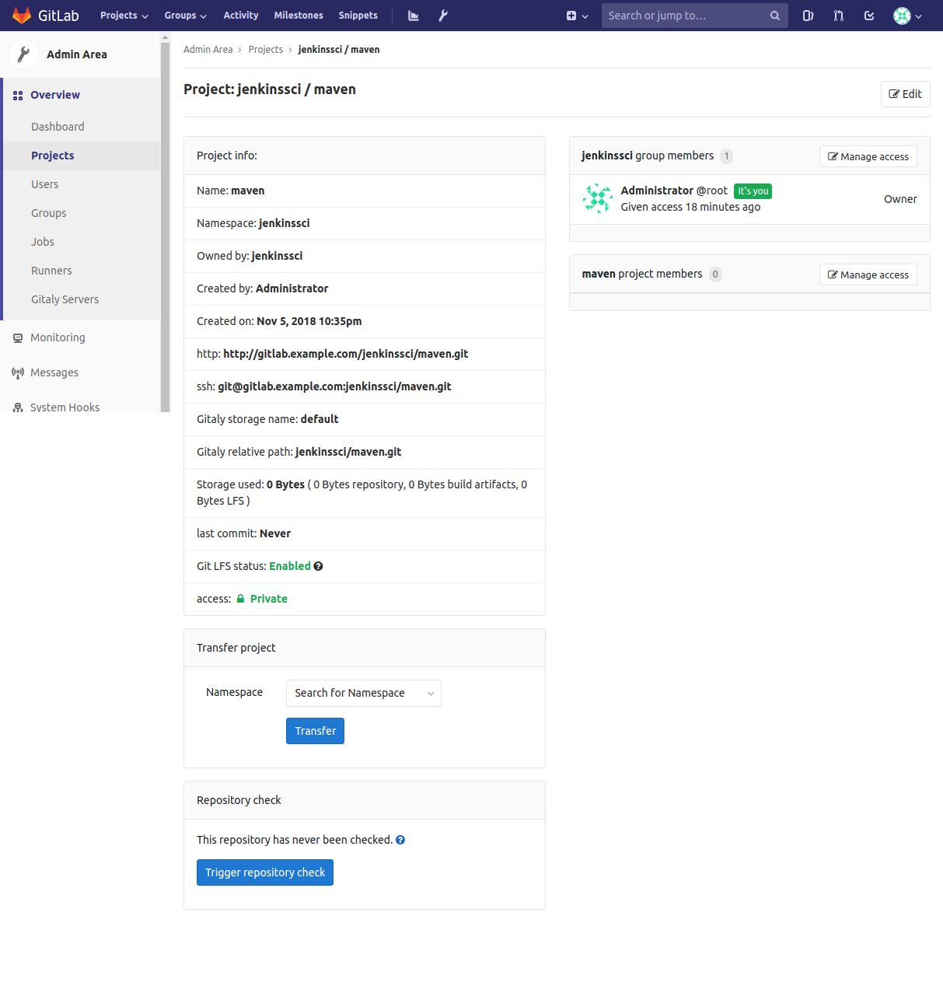

# Jenkins GIT

---------------------------------------------------------

## INSTALACIÓN BÁSICA INICIAL

---------------------------------------------------------

Para ello crearemos nuestra carpeta **jenkins_home** dónde se alojara jenkins usando `mkdir jenkins_home` y `mkdir db_data` para posteriormente asignarle permisos mediante `chown 1000 -R jenkins_home` y `chown 1000 -R db_data` como usuario root (`sudo su`).

```bash
demo@VirtualBox:~/Demo_Docker$ mkdir jenkins_home

demo@VirtualBox:~/Demo_Docker$ sudo su
[sudo] password for demo:
root@hector-VirtualBox:/home/demo/jenkins-by-sample# chown 1000 -R jenkins_home
```

Una vez creada la carpeta, lanzaremos el servicio de jenkins con la configuración de [docker-compose.yml](./docker-compose.yml).

```bash
demo@VirtualBox:~/Demo_Docker$ docker-compose up -d
Starting jenkins ... done

demo@VirtualBox:~/Demo_Docker$ docker ps
CONTAINER ID IMAGE    COMMAND      CREATED   STATUS  PORTS     NAMES
7f41ec7f07ac jenkin.. "/sbin/t..." 55 se...  Up 3..  0.0....   jenkins
```

[Volver al Inicio](#jenkins-git)


## INSTALAR GIT SERVER

---------------------------------------------------------

Ahora aprenderemos a cear un **server GIT** para **jenkins**. Para ello accederemos a **GitLab Docs** (Búsqueda en **google**: **Gitlab CE docker**, [https://docs.gitlab.com/omnibus/docker/](https://docs.gitlab.com/omnibus/docker/))

Para ello a partir de esa documentación añadiremos un nuevo servicio a nuestro **docker-compose.yml**.

_[docker-compose.yml](./docker-compose.yml)_
```diff
version: '3'
services:
  jenkins:
    # ...
  remote_host:
    # ...
  db_host:
    # ...
  web:
    # ...
    ports:
--    - "80:80"  
++    - "8888:80"   
    # ...      
++ git:
++   container_name: git-server
++   hostname: gitlab.example.com
++   ports:
++     - "443:443"
++     - "80:80"
++   volumes:
++     - "/srv/gitlab/config:/etc/gitlab"
++     - "/srv/gitlab/logs:/var/log/gitlab"
++     - "/srv/gitlab/data:/var/opt/gitlab"
++   image: gitlab/gitlab-ce
++   networks:
++     - net
networks:
  net:
```

> **NOTA**: Veremos que existirá un conflicto con respecto a los puertos utilizados por la máquina entre el servicio **web** y el servicio **git**, por ello habrá que modificarlo.

> **NOTA**: Los volúmenes guardaran la información dentro de nuestra máquina.
> **NOTA**: Utilizaremos la imagen referenciada en la documentación.

Una vez actualizado el [docker-compose.yml](./docker-compose.yml), podremos ejecutar el comando de consola `docker-compose up -d` para levantar el servicio.

> **NOTA**: Este proceso se demorará unos minutos ya que la descarga de **gitlab** es muy pesada (más de 1gb). Para ver la evolución de la carga de **gitLab** ejecutaremos el comando `docker logs -f git-server` (si se quedase bloqueado *ctrl+c* y nuevamente `docker logs -f git-server`)

Ahora accederemos a la ubicación [http://localhost:80/](http://localhost:80/)


En esa nueva página se nos pedirá que incluyamos nuestro password (Usaremos **admin_admin**). Y a continuación logueamos con el usuaro **root** y el password anteriormente definido.


Ahora tendríamos nuestro **GitLab server** creado.


[Volver al Inicio](#jenkins-git)


## CREAR REPOSITORIO GITLAB

---------------------------------------------------------

Primeramente generaremos nuestro **hostname** definido dentro de **docker-compose.yml** ( **gitlab.example.com** ), para ello accedemos a [/etc/hosts](/etc/hosts) como usuario root (`sudo su`).

_[/etc/hosts](/etc/hosts)_
```diff
127.0.0.1	localhost
127.0.1.1	hector-VirtualBox
++ 127.0.0.1   gitlab.example.com
# The following lines are desirable for IPv6 capable hosts
::1     ip6-localhost ip6-loopback
fe00::0 ip6-localnet
ff00::0 ip6-mcastprefix
ff02::1 ip6-allnodes
ff02::2 ip6-allrouters
```

Si accedemos a [gitlab.example.com](gitlab.example.com), podremos acceder al **servidor de GitLab**, y accedemos con el usuario **root** con el password **admin_admin**.


Y seleccionamos **Crear un nuevo grupo**, cuyo **group path** será **jenkinsci**.


> **NOTA**: Un Grupo en **GitLab** es una colección de **proyectos**.

Por ello, pulsaremos en la opción de **crear un nuevo proyecto**.


Y designamos como **nombre de proyecto** (**project slug**), **maven**.


Y pulsamos en guardar el nuevo proyecto creado.


**YA HEMOS CREADO NUESTRO GRUPO, CON NUESTRO PROYECTO MAVEN, AHORA EMPEZAREMOS A INCLUIR ARCHIVOS EN EL REPOSITORIO**

[Volver al Inicio](#jenkins-git)


## CREAR UN USUARIO EN GIT CON PERMISOS SOBRE EL REPOSITORIO

---------------------------------------------------------

Ahora accedemos a la **configuración** de **gitlab** (**llave inglesa**), en **Overview** > **Users** y **new user**.


Y completamos la información del usuario para posteriormente guardarlo (user: imaginaGroup)


Una vez creado el usuario, seleccionaremos la opción de **editar** para definir la contraseña (password: 87654321) del mismo y guardamos el usuario.


Ahora accedemos a **Overview** > **proyectos** en el proyecto que queremos que dicho usuario tenga permisos de acceso (**jenkins/maven**).


Y en la opción de **manage access**.



Dentro **Seleccionaremos el miembro** al que queremos invitar al grupo, más el **role permission**, en nuestro caso **developer**, y salvamos la invitación.


[Volver al Inicio](#jenkins-git)


## AGREGAR CÓDIGO JAVA EN EL REPOSITORIO

---------------------------------------------------------

Para clonar el repositorio primeramente accederemos a la terminal del contenedor de **jenkins**, `docker exec -u root -ti jenkins bash`.

Y accedemos dentro de **gitLab server** en el proyecto de **maven** para clonar el repositorio (seleccionamos el comando `git clone http://gitlab.example.com/jenkinssci/maven.git`)


```bash
jenkins@c407bf740a97:/$ git config --global user.name "imaginaGroup"
jenkins@c407bf740a97:/$ git config --global user.email "imaginaGroup@imaginaGroup.com"
jenkins@c407bf740a97:/$ git clone http://gitlab.example.com/jenkinssci/maven.git
fatal: could not create work tree dir 'maven': Permission denied
```

```bash
root@c407bf740a97:/# git clone http://gitlab.example.com/jenkinssci/maven.git
Cloning into 'maven'...
fatal: unable to access 'http://gitlab.example.com/jenkinssci/maven.git/': Failed to connect to gitlab.example.com port 80: Connection refused
root@c407bf740a97:/#
```


