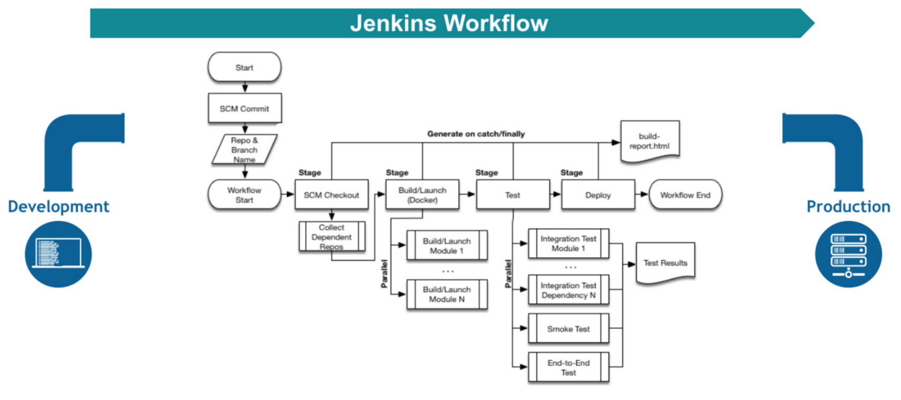

# Jenkins Pipeline

---------------------------------------------------------

## INSTALACIÓN BÁSICA INICIAL

---------------------------------------------------------

Para ello crearemos nuestra carpeta **jenkins_home** dónde se alojara jenkins usando `mkdir jenkins_home` y `mkdir db_data` para posteriormente asignarle permisos mediante `chown 1000 -R jenkins_home` y `chown 1000 -R db_data` como usuario root (`sudo su`).

```bash
demo@VirtualBox:~/Demo_Docker$ mkdir jenkins_home

demo@VirtualBox:~/Demo_Docker$ sudo su
[sudo] password for demo:
root@hector-VirtualBox:/home/demo/jenkins-by-sample# chown 1000 -R jenkins_home
```

Una vez creada la carpeta, lanzaremos el servicio de jenkins con la configuración de [docker-compose.yml](./docker-compose.yml).

```bash
demo@VirtualBox:~/Demo_Docker$ docker-compose up -d
Starting jenkins ... done

demo@VirtualBox:~/Demo_Docker$ docker ps
CONTAINER ID IMAGE    COMMAND      CREATED   STATUS  PORTS     NAMES
7f41ec7f07ac jenkin.. "/sbin/t..." 55 se...  Up 3..  0.0....   jenkins
```

[Volver al Inicio](#jenkins-pipeline)


## PIPELINE

---------------------------------------------------------

**Qué es un PIPELINE?** Un **pipeline** es un flujo de trabaja que muestra los diferentes pasos por los que debemos pasar para llevar nuestro código de desarrollo a producción. Siendo variables, pero entre los que al menos existirá **Continuous Integration** y **Continuous Deployment**

(Ejemplo de internet: **pipeline jenkins**)


> **NOTA**: Los test son importantes ya que son necesarios para que nuestros proyectos se lleven a producción evitando los errores.

[Volver al Inicio](#jenkins-pipeline)


## JENKINSFILE

---------------------------------------------------------

El **jenkinsfile** es la herramienta que dispone **jenkins** que nos permite definir nuestros **stages** en el **pipeline**.

_[first-pipeline](first-pipeline)_
```js
pipeline {
    agent any

    stages {
        stage('Build') {
            steps {
                echo 'Building..'
            }
        }
        stage('Test') {
            steps {
                echo 'Testing..'
            }
        }
        stage('Deploy') {
            steps {
                echo 'Deploying....'
            }
        }
    }
}
```

Existen dos tipos de **Pipeline**: 

* **Declarative Pipeline**, sencillo de interpretar pero bastante rígido.
* **Scripted Pipeline**, es más complejo de leer ya que usa otro lenguage aunque mucho más flexible.

[Volver al Inicio](#jenkins-pipeline)


## PLUGIN PIPELINE

---------------------------------------------------------

El plugin d e**pipeline** de **jenkins** viene instalado por defecto. Para saber si efectivamente disponemos de él, sólamente deberemos acceder a la sección de **Administrar Jenkins** > **Administrar Plugins**, **plugins instalados**.

[Volver al Inicio](#jenkins-pipeline)


## DEFINIR UN PRIMER PIPELINE SIMPLE

---------------------------------------------------------

Para definir nuestro primer **pipeline** deberemos crear un **job** del tipo **pipeline**.


Dentro de la opción de **pipeline** en el **job** generado podemos definirlo como código directamente o mediante **script externos desde un repositorio o control de versiones**.

Nuestro primer **pipeline** será así:

```js
pipeline {
    agent any

    stages {
        stage('Build') {
            steps {
                echo 'Building..'
            }
        }
        stage('Test') {
            steps {
                echo 'Testing..'
            }
        }
        stage('Deploy') {
            steps {
                echo 'Deploying....'
            }
        }
    }
}
```


Ahora podremos guardar el **job** y construirlo.

Al construirlo se mostrará una gráfica con cada uno de los **stage** de la ejecución, mostrando información relativa de cada paso, informando si se producen errores.


> **NOTA**: Además podremos entrar en la terminal para ver la salida del **job**.

[Volver al Inicio](#jenkins-pipeline)


## AGREGAR PASOS A PIPELINE

---------------------------------------------------------

En el primer ejemplo cara **stage** disponía de una única acción (o **pasos**).

**¿Qué ocurriría si quiseramos que cada stagge tuviera más de una acción?** Para eso haríamos como en el ejemplo siguiente:

```js
pipeline {
    agent any
    stages {
        stage('Build') {
            steps {
                sh 'echo "Este es mi primer pipeline"'
                sh '''
                    echo "Por cierto, puedo ejecutar más acciones aquí"
                    ls -lah
                '''
            }
        }
    }
}
```

Usaremos cada línea independiente dentro de los **steps** para definir los distintos comandos del steps. 

En caso de quere introducir saltos de línea usaremos las tres comillas del ejemplo.

Cambiamos ahora el contenido de nuestro **job Pipeline** por la definición nueva del **pipeline**, guardamos el **job** y lo volvemos a construir nuevamente.

Una vez construido veremos que ahora nuestro **pipeline** tiene un único **satge**.


Ahora podremos acceder a la terminal para ver la salida obtenida.

[Volver al Inicio](#jenkins-pipeline)


## RETRY

---------------------------------------------------------

Los reintentos en **pipeline** se definen como el número de veces que pueden reintentarse ciertas tareas si estas fallan.

```js
pipeline {
    agent any
    stages {
        stage('Timeout') {
            steps {
                retry(3) {
                    sh 'No voy a funcionar :c'
                }
            }
        }
    }
}
```


Ahora entraremos dentro de la configuración del **job Pipeline** y modificaremos el **pipeline** definido, guardando nuevamente el **job** y construyendo para obtener el siguiente resultado.


Si accedemos a la consola veremos que dentro de la salida el mismo **pipeline** se ejecutó tres veces, ya que falló al no encontrar el código definido en el **script sh**.


[Volver al Inicio](#jenkins-pipeline)


## TIMEOUT

---------------------------------------------------------

Puede darse el hecho de que esperemos que una tarea se demore ne exceso, por eso podemos poner un **timeout** o tiempo límite tras el cual si al ejecutar uno de los **stage**superamos ese tiempo se cancelaría dicho paso.

> **NOTA**: Los **Stage** que sobrepasen ese **timeout** pueden reintentarse (**retry**).

Para ello usaremos el siguiente **pipeline** de ejemplo:

```js
pipeline {
    agent any
    stages {
        stage('Deploy') {
            steps {
                retry(3) {
                    sh 'echo hola'
                }

                timeout(time: 3, unit: 'SECONDS') {
                    sh 'sleep 5'
                }
            }
        }
    }
}
```

Al cambiar la **configuración** del **job pipeline** para actualizar el **pipeline**, guardarla y construirla obtendremos la siguiente salida:


Ahora podremos acceder a la terminal para visualizar el proceso.


En el siguiente ejemplo, aunque exista un **timeout** este se reintentará construir (**retry**) 5 veces.

```js
pipeline {
    agent any
    stages {
        stage('Deploy') {
            steps {
                timeout(time: 2, unit: 'SECONDS') {
                    retry(5) {
                        sh 'sleep 3'
                    }
                }
            }
        }
    }
}
```

Guardamos la nueva configuración, la construimos y analizamos.

[Volver al Inicio](#jenkins-pipeline)


## POST ACTIONS

---------------------------------------------------------

Al igual que los **jobs** básicos, los **pipeline** disponen de una serie de acciones que se desencadenan una vez se concluyan los **stages**.

```js
pipeline {
    agent any
    stages {
        stage('Test') {
            steps {
                sh 'echo "Fail!"; exit 1'
            }
        }
    }
    post {
        always {
            echo 'Siempre me voy a ejecutar :D'
        }
        success {
            echo 'Solo me ejecutaré si el build no falla'
        }
        failure {
            echo 'Solo me ejecutaré si el build falla'
        }
        unstable {
            echo 'Solo me ejecutaré si me marco como inestable'
        }
        changed {
            echo 'El pipeline estaba fallando pero ahora está correcto o visceversa'
        }
    }
}
```

A partir de los siguientes comandos o tipos definimos cuando se ejecutarían las siguientes **post-actions**.

* **always**, indicado para notificaciones que siempre deben realizarse
* **success**, sólo ocurriría si el **job** se ejecuta correctamente, por ejemplo almacena el **.jar**.
* **failure**, sólo si falla el **job**, por ejemplo enviar un email.
* **unstable**, sólo se ejecutaría si el **job** resultara inestable (se verá posteriormente**)
* **changed**, se enviará si cambia el resultado del **job**.

Copiamos el **pipeline** dentro de la configuración del **job**, guardamos, construimos y analizamos la salida.


Ahora cambiaremos el **job** para que no falle.

```diff
pipeline {
    agent any
    stages {
        stage('Test') {
            steps {
--              sh 'echo "Fail!"; exit 1'
++              sh 'echo "Fail!"'
            }
        }
    }
    post {
        always {
            echo 'Siempre me voy a ejecutar :D'
        }
        success {
            echo 'Solo me ejecutaré si el build no falla'
        }
        failure {
            echo 'Solo me ejecutaré si el build falla'
        }
        unstable {
            echo 'Solo me ejecutaré si me marco como inestable'
        }
        changed {
            echo 'El pipeline estaba fallando pero ahora está correcto o visceversa'
        }
    }
}
```

Cambiamos el **pipeline** dentro de la configuración del **job**, guardamos, construimos y analizamos la salida.

[Volver al Inicio](#jenkins-pipeline)


## VARIABLES DE ENTORNO

---------------------------------------------------------

Al igual que los **jobs básicos** de *jenkins** los **pipeline** de **jenkins** disponen de **variables de entorno**.

```js
pipeline {
    agent any

    environment {
        NOMBRE = 'ricardo'
        APELLIDO    = 'gonzalez'
    }

    stages {
        stage('Build') {
            steps {
                sh 'echo $NOMBRE $APELLIDO'
            }
        }
    }
}
```

Existen dos posibilidades de usar las **Variables de entorno**, ya sea de forma **global**, como en el anterior **pipeline**, o dentro de cada **stage**.

Ahora accederemos al **job pipeline** y cambiaremos la configuración, guardaremos el **jobs pipeline** y lo construiremos, para visualizar y analizar la salida de la terminal (en la que visualizaremos la salida incluidas las variables de entorno).

[Volver al Inicio](#jenkins-pipeline)


## CREDENCIALES EN PIPELINE

---------------------------------------------------------

**Pipeline** también puede gestionar las credenciales para su uso.

Para la demo crearemos una nueva **credencial** tipo **secret text** con valor **1234**, y con **ID** valor **MY-SECRET**.

Usaremos el siguiente **pipeline**

> **NOTA**: **pipeline** rescata el valor de la credencial con el comando `credentials`.

```js
pipeline {
    agent any
    
    environment {
        secretito = credentials('MY-SECRET')
    }
    stages {
        stage('Example stage 1') {
            steps {
                sh 'echo $secretito'
            }
        }
    }
}
```

Una vez creado el credencial **MY-SECRET**, podremos modificar el **job pipeline** incluyendo el **pipeline** anterior, para guardarlo, construirlo y analizarlo en la salida de la terminal.

> **NOTA**: **Jenkins** detectará el uso de **credenciales** por lo que ocultará la salida colocando asteriscos.